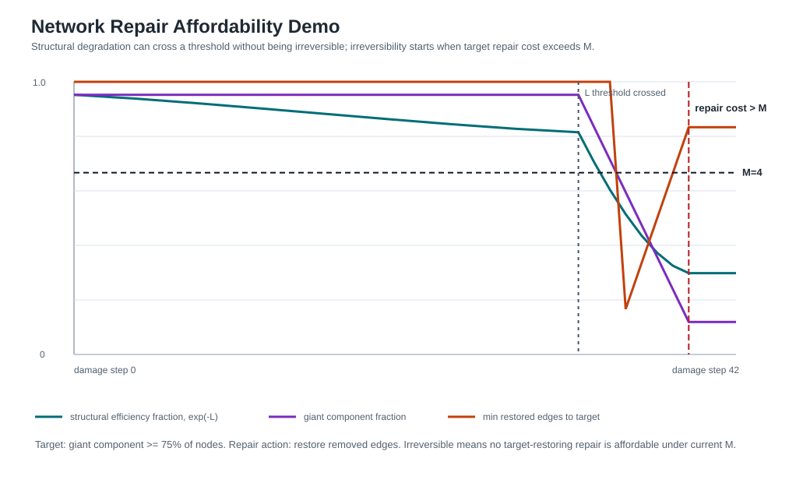

# Structural Persistence Theory: Two-Ledger Accounting, Collapse Modes, and Formal Verification

**Akihito Sunagawa**

## Abstract

We present Structural Persistence Theory (SPT), a two-ledger accounting framework for systems that can lose structure and resources in different ways. The multiplicative ledger L measures structural viable-set shrinkage; the additive ledger M measures resource income and cost. Their combination S_n = M_n exp(−L_n) yields a collapse-mode discriminant: finite-horizon existence failure occurs through the additive resource axis, while the multiplicative structural axis remains positive at every finite step. The structural axis is nevertheless not inert: crossing an L-threshold can change the repair-cost landscape, and recovery is impossible when every target-restoring repair costs more than the available M.

The mathematical foundation is a representation theorem for the structural ledger. Under normalization, additivity, continuity, and nonnegativity, the stage-loss function is forced to be f(r) = −k log r; no non-logarithmic alternative satisfies the axioms. The persistence kernel m(V_n) = m(V_0) exp(−L_n) is then a telescoping identity. With repair, the net loss b_t = d_t − r_t replaces stage loss, giving m(V_n) = m(V_0) exp(−B_n). The structural second law — that cumulative total production Σ_n is monotone nondecreasing — is proved as a necessary and sufficient characterization.

The formalization comprises 432 Lean 4 modules with zero sorry/admit/axiom. Conditional bridges to classical results — Shannon's uniqueness theorem, Jaynes' maximum entropy principle, Landauer's principle, the Crooks fluctuation theorem, and others — are constructed as accounting readouts under domain-specific witnesses. The Lean development packages several persistence-facing projections of information theory, thermodynamics, statistical mechanics, dynamics, network science, information thermodynamics, and information geometry through one `MLDomain` interface and a narrow categorical projection. The latest repair-affordability layer also connects native trajectories or certificates — Kalman covariance, BSC retransmission reliability, finite-block achievability/obstruction witnesses and certificates, network repair thresholds, and causal adjustment certificates — to target recovery or recovery infeasibility under a finite resource budget. These results establish a mechanically verified accounting framework and a testable collapse-mode prediction; they do not constitute empirical validation of that prediction.

---

## 1. Introduction

### 1.1 The question

Structure can be lost even when resources remain. An organization may retain budget and personnel yet lose the ability to make coherent decisions. Software may retain computational resources yet become unmaintainable as dependency conflicts accumulate. A long-context language model may retain parameters yet lose logical consistency as unresolved contradictions build up.

In each case, what is lost is not the substrate but the set of states that can still sustain the structure. SPT formalizes this observation: structural loss is the shrinkage of the viable set, measured by a log-ratio scale that is uniquely forced by natural axioms.

### 1.2 Contributions

1. **Two-ledger accounting**: Additive resources M and multiplicative structural loss L are tracked as distinct ledgers. In the combined scalar S_n = M_n exp(−L_n), finite-horizon zero crossing is forced by the M-axis, not by the exponential L-axis; the L-axis instead controls structural thresholds and repair-cost lower bounds (§4b).

2. **Log-ratio foundation**: Under normalization, additivity, continuity, and nonnegativity, the structural stage-loss function must be f(r) = −k log r. No other form is consistent (§3).

3. **Structural second law**: Cumulative total production Σ_n is monotone nondecreasing, proved as necessary and sufficient under two conditions: positive measure and non-free repair (§4).

4. **Formal verification**: 432 Lean 4 modules, zero sorry/admit/axiom, with conditional bridges to 60+ fields, a theorem map separating formal claims from non-claims, and a bundled `MLDomain` layer for persistence-facing projections of several major theories (§6).

### 1.3 What this paper does not claim

- SPT does not claim that all systems decay exponentially. The exponential form is a representation theorem for the viable-set measure, not an empirical law about any specific system.
- SPT does not replace domain-specific dynamics. It provides the accounting coordinates; the dynamics are supplied by each domain.
- The conditional bridges are not unconditional proofs of classical theorems. Each bridge requires domain-specific witnesses (choice of viable set V, measure m, and positivity verification).
- The M/L collapse-mode discriminant is a mechanically verified prediction of the accounting model. It is not yet an empirically validated law; the included simulations illustrate the prediction but do not test it against external data.
- The grand-theory layer does not claim that information theory, thermodynamics, statistical mechanics, dynamics, network science, information thermodynamics, and information geometry are the same native theorem. It claims that their persistence-facing projections can be read through the same Lean interface when the required witnesses are supplied.

### 1.4 What is not mathematically new

- The **representation theorem** is a standard consequence of the Cauchy functional equation (19th century). The application to viable-set ratios is the contribution, not the equation itself.
- The **persistence kernel** m(V_n) = m(V_0) exp(−L_n) is a **telescoping identity** — a definitional rewriting, not an empirical discovery.
- The **structural second law** (Σ monotone) is trivially true given the assumption of nonneg step production. The non-trivial content is in the **necessity theorems**: FreeRepairImpossibility shows that relaxing gain ≤ cost breaks monotonicity; ConverseSecondLaw shows the characterization is biconditional.
- In **loss-only mode** (no repair), SPT's cumulative net action coincides exactly with the **cumulative hazard** of survival analysis (Λ(t) = −log S(t)). The structural difference lies in the repair term: SPT's signed net action b_t = d_t − r_t can be negative (net recovery), which cumulative hazard cannot. This is proved in NonIdentityTheorem.
- Of the ~432 modules, approximately 20 are **Tier A** (core-routed, with non-trivial conclusions). Approximately 160 are **Tier C** (vocabulary mappings, not theorems). The mathematical weight is concentrated in Tier A and the core.

## 2. Setup

### 2.1 Structural maintenance problem

Fix a system X. A **structural maintenance problem** Π = (X, G) consists of:

- A state space X
- A maintenance condition G that defines which states can sustain the structure
- The **viable set** V_G = {x ∈ X : x satisfies G} — following Aubin's viability theory (1991)
- A **measure** m on X, fixed before observation, that quantifies the "room remaining"

### 2.2 Viable-set dynamics

Constraints accumulate over time:

    V_0 ⊇ V_1 ⊇ ··· ⊇ V_n

Each step consists of **contraction** (constraints shrink V) followed by **repair** (recovery expands V):

    V_t^− = K_t(V_t)          [contraction stage]
    V_{t+1} = R_t(V_t^−)        [repair stage]

### 2.3 Stage loss and repair

The **stage loss** at step t:

    d_t = −log(m(V_t^−) / m(V_t))

The **repair amount** at step t:

    r_t = log(m(V_{t+1}) / m(V_t^−))

The **net loss**:

    b_t = d_t − r_t

These terms follow the terminology of loss/repair standard in information theory and reliability engineering. The v4 naming aligns with Aubin (viable set), Shannon (stage loss), and engineering (repair).

### 2.4 Cumulative quantities

Cumulative stage loss: L_n = Σ_{t<n} d_t

Cumulative net loss: B_n = Σ_{t<n} b_t

Effective resource: M_n, evolving as M_{n+1} = M_n + income_n − cost_n

### 2.5 Total production

Under a **repair budget** (repair gain ≤ repair cost at each step), total production is:

    Σ_n = B_n + C_n = L_n + slack_n

where C_n is cumulative repair cost and slack_n = C_n − (cumulative gain) ≥ 0.

## 3. The Representation Theorem

### 3.1 Axioms for stage loss

A **stage-loss functional** f : (0,1] → ℝ satisfying:

- **B2 (Normalization)**: f(1) = 0 — no shrinkage, no loss
- **B3 (Additivity)**: f(r₁ r₂) = f(r₁) + f(r₂) — sequential losses compose
- **B4 (Continuity)**: f is continuous — small changes, small losses
- **Nonnegativity**: f(r) ≥ 0 for r ∈ (0,1] — shrinkage is nonnegative loss

### 3.2 Uniqueness

**Theorem 1 (Representation).** Any stage-loss functional satisfying B2+B3+B4+nonnegativity must have:

    f(r) = −k log r,  k ≥ 0

*Proof sketch.* B3 is the Cauchy functional equation f(xy) = f(x) + f(y). Under B4 (continuity), the unique solution is f(r) = c · log r. B2 is automatic. Nonnegativity on (0,1] forces c ≤ 0, giving f(r) = −k log r with k ≥ 0. Lean: `RepresentationTheorem.loss_must_be_log`. □

*Note.* This is a classical result (Cauchy 1821, applied to entropy by Shannon 1948). The mathematical content is the application to viable-set ratios, not the equation itself.

**Corollary (Persistence kernel).** For any positive mass sequence:

    m(V_n) = m(V_0) · exp(−L_n)

where L_n = Σ l_i. At k = 1 (structural nats), S = M exp(−L). Lean: `TelescopingExp.measure_eq_initial_mul_exp_neg_cumulative_loss`.

### 3.3 Impossibility

**Theorem 2 (Impossibility).** No non-logarithmic function satisfies B2+B3+B4+nonnegativity.

- Linear a(1−r) violates B3
- Quadratic a(1−r)² violates B3
- Power ar^α (α ≠ 0) violates B3

Lean: `ImpossibilityTheorem.impossibility_of_non_log`.

### 3.4 Relation to Shannon

The representation theorem has the same mathematical skeleton as Shannon's uniqueness theorem for entropy (1948). Both derive from the Cauchy functional equation; both force a logarithmic form. The difference is in the domain: Shannon measures message uncertainty; SPT measures viable-set shrinkage. Lean: `RepresentationTheorem.shannon_analogy`.

SPT does not claim to be Shannon's theorem. It shares a common mathematical ancestor (the Cauchy equation) and records the correspondence (`NonIdentityTheorem`).

## 4. The Structural Second Law

### 4.1 Statement

**Theorem 3 (Structural Second Law).** Under:
1. Positive trajectory (m(V_t) > 0 for all t)
2. Repair budget (gain ≤ cost at each step)

cumulative total production Σ_n is monotone nondecreasing.

Lean: `StructuralSecondLaw.deterministic_second_law`.

*Note.* This inequality is trivially true given the assumption: nonneg terms sum to a monotone sequence. The non-trivial content is in Theorems 4-6 below, which show the characterization is biconditional and the resource constraint is necessary.

**Theorem 4 (Converse).** Σ_n monotone ⟺ stepTotalProduction ≥ 0 at every step.

Lean: `ConverseSecondLaw.second_law_iff_nonneg_steps`.

### 4.2 Three layers

| Layer | Statement | Lean module |
|-------|-----------|-------------|
| Deterministic | Σ_n pointwise monotone | `StructuralSecondLaw.deterministic_second_law` |
| Stochastic | E[Σ_n] monotone (a.s. nonneg increments) | `StructuralSecondLaw.stochastic_second_law` |
| Coarse-graining | Monotonicity transfers through admissible maps | `StructuralSecondLaw.coarse_second_law` |

### 4.3 Necessity of conditions

**Theorem 5 (Free Repair Impossibility).** If gain > cost at any step, Σ can decrease. The repair budget is necessary. Lean: `FreeRepairImpossibility.free_repair_implies_negative_production`.

**Theorem 6 (Minimal Axioms).** The two conditions are minimal and jointly sufficient. Lean: `MinimalAxiomTheorem.minimal_axioms_give_monotone_sigma`.

## 4b. Resource Dynamics (M-side)

The resource level M was previously treated as a static parameter. It is now dynamically tracked:

    M_{n+1} = M_n + income_n − cost_n

**Theorem 7 (Resource depletion).** If cumulative cost exceeds initial M plus cumulative income, M becomes negative. Lean: `ResourceDynamics.resource_depleted_when_cost_exceeds`.

**Theorem 8 (M-side second law).** Without external income, M is nonincreasing. Lean: `ResourceDynamics.closed_system_M_nonincreasing`.

**Theorem 9 (Collapse-mode discriminant).** Let R_n = exp(−L_n) and S_n = M_n R_n. Since R_n > 0 at every finite horizon,

    S_n ≤ 0  ⟺  M_n ≤ 0

Lean: `CollapseModeDiscriminant.collapse_is_additive_not_multiplicative`.

This completes the S = M exp(−L) picture: both factors are now dynamically tracked, and the theory formally distinguishes additive resource exhaustion from multiplicative structural degradation. A pure L-axis trajectory can decay arbitrarily far, but it does not hit zero in finite time. Finite-horizon existence collapse is an M-axis zero crossing. Lean also proves that, under fixed resource accounting, the death horizon is independent of the structural decay rate (`death_horizon_independent_of_decay`).

**Prediction 1 (Operational collapse-mode prediction).** If a system admits separately observable proxies for additive resource balance M_n and multiplicative structural loss L_n, then finite-horizon terminal failure should coincide with an M-axis zero crossing, not with the multiplicative L-axis reaching zero. Structural degradation may precede failure, but the terminal event is predicted to be a resource crossing.

This prediction is falsifiable in the modest sense relevant here. A single-axis hazard or Kelly-style multiplicative model predicts collapse as loss accumulation on one multiplicative coordinate. The M/L ledger predicts a qualitative separation:

    gradual structural degradation + terminal additive resource crossing

The repository includes a simulation script, `scripts/simulate_collapse_modes.py`, which generates example trajectories and records the predicted event types. The default run produces an M-axis collapse, a mixed-mode M-axis collapse, and a pure L-axis trajectory with no finite zero crossing over the simulated horizon. These are model checks and visualizations, not empirical validation.

The companion network-repair demo, `scripts/simulate_network_repair_affordability.py`, illustrates the repair-feasibility refinement rather than an empirical test. It uses a hand-crafted clustered network, measures L by global-efficiency log loss, and estimates repair cost by a greedy restore-removed-edges policy for a giant-component target. Structural-threshold crossing and the first unaffordable repair step are distinct events. A randomized ensemble companion runs the same separated measurements on ER, scale-free, and small-world graphs under random and targeted edge attacks; it is generated by `scripts/simulate_network_repair_ensemble.py` and writes detail/summary CSV files plus a figure under `data/simulations/` and `paper/figures/`. A small exact-search check, `scripts/validate_network_repair_greedy.py`, compares the greedy repair estimate against brute-force subset search on small random graphs and writes `data/simulations/network_repair_greedy_validation.csv`.

### 4b.1 Irreversibility as repair infeasibility

The collapse-mode discriminant locates the zero crossing, but it is not yet a complete irreversibility criterion. A structure can be arbitrarily degraded without being literally zero, and a resource account can be zero without being absorbing in an open system. The sharper notion is repair feasibility: irreversibility is not identified with damage, decay, or low function. It is a target-relative feasibility claim. Recovery is impossible only when every action that restores the target exceeds the available resource budget.

Given a target structural level T, a set of repair actions a, a repair cost cost(a), and the restored level restored(a), recovery to T is feasible from available resource M when:

    ∃ a, restored(a) ≥ T and cost(a) ≤ M

It is infeasible when every action that reaches the target costs more than the available resource:

    ∀ a, restored(a) ≥ T -> M < cost(a)

**Theorem 10 (Irreversibility as repair infeasibility).** If every repair action capable of restoring the target costs more than the available resource, then recovery to that target is impossible. Lean: `ReversibilityCriterion.irreversible_if_repair_cost_exceeds_resource`.

The converse sanity checks are also formalized. If an affordable target-restoring repair exists, irreversibility cannot be concluded from low structure alone (`not_irreversible_if_affordable_repair_exists`). If M_n = 0 but the next step has surplus income, then the additive resource ledger becomes positive again (`zero_M_recovers_with_surplus_income`). Conversely, in a closed system, once the resource ledger is nonpositive it remains nonpositive (`closed_M_nonpositive_stays_nonpositive`). Thus irreversibility is not "small L" or "zero M" by itself; it is a failed repair-feasibility inequality.

This also gives a precise formulation of irreversible threshold phenomena. An exponential or multiplicative approach to a critical boundary is not, by itself, irreversible. It becomes irreversible when the threshold crossing activates a lower bound on target-restoring repair cost and the available resource lies below that bound:

    L_n ≥ Lcrit
    L_n ≥ Lcrit -> cost(a) ≥ Ccrit
    M_n < Ccrit

Lean: `ReversibilityCriterion.irreversible_of_threshold_crossing_and_resource_shortfall`.

## 5. Complete Scope Closure

### 5.1 Applicable systems

Every system with m > 0 and gain ≤ cost admits the unique form S = M exp(−L). The two conditions are necessary and sufficient. The functional form is unique and the axiom system is minimal.

### 5.2 Inapplicable systems

| Condition violated | Failure mode | Lean proof |
|--------------------|-------------|------------|
| m = 0 | Log-ratio undefined | `ScopeBoundaryTheorem` |
| m < 0 | Physically meaningless | `CompleteScopeClosure` |
| gain > cost | Second law violated | `FreeRepairImpossibility` |
| Constant mass | L = 0 (theory trivial) | `ScopeBoundaryTheorem` |

No fifth category exists. Lean: `CompleteScopeClosure.classification_exhaustive`.

## 6. Lean 4 Formalization

### 6.1 Scale

- 432 modules, 3,596 build jobs
- sorry = 0, admit = 0, axiom = 0
- Lean 4 v4.26.0 + Mathlib v4.26.0
- Repository: https://github.com/karesansui-u/persistence-lean

### 6.2 Architecture

The formalization is organized in layers:

| Layer | Modules | Content |
|-------|---------|---------|
| 0–4 | Core kernel | Telescoping, log-uniqueness, resource budget, dynamics |
| 5–6 | SAT/CSP | Finite-horizon Chernoff/KL bounds, 9 CSP specializations |
| 7–8 | Markov models | Foster-Lyapunov, finite-state Markov, repair chains |
| 9 | Route A skeletons | Serial reliability, BSC, fatigue, queue, etc. |
| 10–11 | Unification | CrossClassV0–V3, StructuralSecondLaw |
| Tier S | Meta-theorems | Representation, Impossibility |
| Tier S+ | Necessity | FreeRepair, MinimalAxiom, Separation, Converse |
| Tier S++ | Completeness | Stability, Duality, Invariance, CompleteScopeClosure |
| Tier S+++ | Validation | Falsifiability, NonIdentity, Constructive, TimeReversal |

### 6.3 Conditional bridges (honest tier classification)

The ~432 modules include cross-domain bridges at three tiers:

- **Tier A (~20 bridges)**: Invoke the SPT core (TelescopingExp, StructuralSecondLaw, or ImpossibilityTheorem) to derive domain conclusions that don't follow from single-step properties. Examples: GronwallBridge (discrete Gronwall inequality), CrooksCompleteTheorem (Jarzynski→Jensen chain), OptimalReviewSchedule (minimax via pigeonhole).
- **Tier B (~3 bridges)**: Algebraic correspondences with real content but no mechanical core invocation. Examples: ClausiusBridge, BoltzmannEntropyBridge, RuinTheoryBridge.
- **Tier C (~160 bridges)**: Vocabulary mappings that read domain quantities through SPT terminology. These are **not** theorems. Some contain lightweight algebra; others are naming conventions.

The mathematical weight is in Tier A and the core. Tier C exists for completeness but carries no proof weight.

### 6.4 M/L interface, grand readings, and categorical projection

The newest Lean layer makes the cross-domain claim more precise. The typeclass `MLDomain` packages the native loss certificate for a domain and gives all instances the same readout theorem, `universal_persistence_law`. A bundled structure, `FiveDomainWitnesses`, records five distinct entry modes: convex/log-Bregman absorption, PAC version-space shrinkage, additive Lyapunov cost, stochastic drift income, and serial-reliability threshold firing. These examples are intentionally heterogeneous: some are new inequalities, some are existing domain theorems routed through the ledger, and the Lyapunov example lives on the additive M-axis rather than being another exponential-shrink copy.

A newer repair-affordability spine makes the interface operational rather than merely semantic. Kalman target covariance recovery is tied to a closed-form covariance trajectory, an observation lower bound, and an observation budget. BSC target reliability is tied to a BSC-native retransmission profile `1 - errorRate^(r+1)`, bounded monotone reliability certificates, redundancy cost, and repair budget. The finite-block layer is two-sided but certificate-mediated: achievability certificates can imply affordable target recovery, while finite obstruction certificates can imply target-recovery infeasibility; optional rate/capacity metadata may be carried, but it does not generate the certificate. The rank-probability substrate now includes generic finite-uniform event ratios, one-step uniform-PMF event masses in both `ENNReal` and real readout forms, rectangular finite-uniform and sequential PMF product-event masses including fixed two-state prefix escape, supplied constant conditional-mass dependent-event rules, a fixed-rank dependent prefix-pair rule whose second-stage mass is derived from the certified prefix-state PMF theorem, proof-indexed and totalized on-event evolving successor-state two-step rules whose second prefix state is constructed from the first sampled column when the first escape event occurs, proof-indexed second-successor rank `k+2` construction on that two-step event, canonical empty-prefix state and one-step mass certificate, supplied two-step stored-state and product consistency, binary span-counting, finite span-escape fraction lemmas, span-complement PMF event masses, fixed-state one-step and fixed-two-state escape-mass readouts, reusable one-step transition-mass certificates, supplied-step product certificates, coherent supplied prefix-growth process certificates, deterministic event-to-rank-growth, prefix-state, and explicit state-transition lemmas, and a deterministic full-rank escape product with ratio/product bounds and positivity; these are not yet a random-prefix process, sampled-column independence theorem or sampled-column conditional-product theorem along evolving prefixes, random-matrix rank-failure theorem, or Shannon theorem. The causal layer packages adjustment-formula certificates as producer data for causal-effect and information-gain readouts, without deriving do-calculus or identifiability criteria. These are target-relative recovery statements: the domain supplies a native trajectory, certificate, or witness; the M/L ledger decides whether the target-restoring action is affordable.

The broader `GrandTheoryReadings` structure records persistence-facing projections of seven large theoretical families:

| Reading | Native meaning | Persistence-facing projection |
|---------|----------------|-------------------------------|
| Information theory | entropy, mutual information, KL | loss / information divergence |
| Thermodynamics | possible change and cost | resource and dissipation accounting |
| Statistical mechanics | micro–macro passage | Jensen defect under coarse-graining |
| Dynamics | stability, attractors, drift | Lyapunov-style budget |
| Network science | structural interaction | threshold and fragmentation readouts |
| Information thermodynamics | information–energy coupling | product composition of ledgers |
| Information geometry | statistical shape | Bregman / categorical invariance |

This is a semantic bundle, not a triumphal identity claim. The Lean theorem `grandTheoryReadings_commonProfiles` states that all supplied readings inherit the common persistence profile through the same interface. It does not state that the native domain theorems are identical.

Finally, `domainStructuralProblem` forgets the additive M-axis and projects any `MLDomain` into the existing Mathlib-backed category `StructuralMaintenanceProblem`. Gauge-1 isomorphisms in that category preserve cumulative native loss. This categorical connection is deliberately narrow: it checks compatibility with a genuine category, but it is not a claim that all native theories have been merged into one giant category.

## 7. Three Observability Layers

Following v4, the theory operates at three observability layers:

| Layer | Observability | Role |
|-------|--------------|------|
| **Specification-fixed** | V, m, boundary fixed by specification | Theorems, finite-time bounds, strong verification |
| **Conditional embedding** | Existing theory's drift/difference mapped to SPT variables | Formal bridges to Foster-Lyapunov, queueing, etc. |
| **Structural estimation** | V not directly countable; proxy indicators + pre-registered tests | Prediction, diagnosis, intervention candidates |

These are not three different theories. They are three observability levels of the same kernel S = M exp(−L). The difference is how much of V, m, d_t, r_t can be directly observed or specified.

## 8. Related Work

SPT relates to but is structurally distinct from:

- **Thermodynamics**: SPT borrows the accounting style of production, cost, and irreversibility, but it is not a thermodynamic law. It allows open-system repair and resource income, so B_n can be negative even when total production remains budgeted. (`NonIdentityTheorem`)
- **Information theory**: SPT shares the logarithmic functional form with Shannon-style uniqueness arguments, but it measures viable-set shrinkage rather than message uncertainty. The overlap is mathematical, not an identity of domains. (`NonIdentityTheorem`)
- **Survival analysis and hazard models**: In loss-only mode (no repair, M = 1), SPT's cumulative net action **coincides exactly** with the cumulative hazard Λ(t) = −log S(t). The two-ledger extension is different: survival-style models usually place ruin on a single multiplicative axis, whereas SPT predicts finite-horizon existence collapse through the additive resource axis. (`NonIdentityTheorem.loss_only_coincides_with_hazard`)
- **Kelly and multiplicative growth**: Kelly-style wealth dynamics are multiplicative. SPT can represent multiplicative structural degradation, but its collapse-mode discriminant says terminal existence failure requires an additive resource crossing. This is the key empirical distinction.
- **Viability theory (Aubin 1991)**: SPT adds an accounting layer to viability theory — measuring how much the viable kernel has shrunk, not just whether viable trajectories exist. (`ViabilityKernelBridge`)

## 9. Limitations

- **No dynamics**: SPT accounts for structural loss but does not supply dynamical equations.
- **G is external**: The choice of maintenance condition requires domain knowledge.
- **Finite horizon**: Core results are finite-horizon. Asymptotic extensions require additional assumptions.
- **Bridges are conditional**: Each domain bridge requires domain-specific witnesses.
- **Prediction not yet validated**: The collapse-mode discriminant is a formal prediction of the M/L accounting model. External experiments or observational datasets are still needed to test whether real systems fail through the predicted resource zero-crossing pattern.
- **Repair-cost model is external**: The irreversibility criterion requires a domain-specific model of repair actions, repair costs, and target structural levels. SPT supplies the feasibility inequality, not the repair technology.
- **Information-theoretic witnesses/certificates, not Shannon coding theorem**: The BSC and finite-block layers connect retransmission profiles and finite-block achievability/obstruction witnesses and certificates to M/L affordability. Binary span-escape lemmas now reach a one-step finite-uniform PMF event-mass bridge in both `ENNReal` and real readout forms, rectangular finite-uniform and sequential PMF product-event rules including fixed two-state prefix escape, supplied constant conditional-mass dependent-event rules, a fixed-rank dependent prefix-pair rule whose second-stage mass is derived from the certified prefix-state PMF theorem, proof-indexed and totalized on-event evolving successor-state two-step rules, proof-indexed second-successor rank `k+2` construction on that two-step event, canonical empty-prefix state and one-step mass certificate, supplied two-step stored-state and product consistency, fixed-state one-step and fixed-two-state escape-mass readouts, reusable one-step transition-mass certificates, supplied-step product certificates, coherent supplied prefix-growth process certificates, and deterministic event-to-rank-growth / prefix-state / explicit state-transition lemmas, but they do not yet provide a random-prefix process, sampled-column independence theorem or sampled-column conditional-product theorem along evolving prefixes, or random-matrix rank-failure probability theorem. They do not formalize an asymptotic Shannon coding theorem, capacity-achieving construction, or strong converse.
- **Causal certificates, not do-calculus**: The adjustment layer can consume an adjustment-formula certificate and read it through M/L first loss. It does not derive SCM identifiability, back-door, front-door, or do-calculus rules.
- **Semantic, not total, unification**: The `MLDomain` and `GrandTheoryReadings` layers unify persistence-facing projections. They do not subsume the full native content of information theory, thermodynamics, statistical mechanics, dynamics, network science, information thermodynamics, or information geometry.

## 10. Conclusion

Structural Persistence Theory provides a formally verified two-ledger accounting framework for persistence, degradation, repair, and collapse. The central object is not merely the exponential kernel, but the separation between additive resources M and multiplicative structural loss L. That separation yields a finite-horizon collapse-mode discriminant: structural degradation can be gradual while terminal existence failure is triggered by an additive resource zero crossing. Irreversibility is then sharpened from "near zero" language to a repair-feasibility criterion: recovery is impossible when every target-restoring repair costs more than the resources available.

The log-ratio representation theorem supplies the structural ledger: under normalization, additivity, continuity, and nonnegativity, viable-set shrinkage has the unique form f(r) = −k log r. The Cauchy argument is classical; the contribution is its integration into a two-ledger persistence accounting framework, its scope closure, and its machine-checked cross-domain interface.

The Lean 4 formalization with 432 modules and zero sorry/admit provides machine-checked confidence in the mathematical core. The M/L ledger layer adds a verified collapse-mode discriminant, target-relative repair-affordability readouts, and a bundled cross-domain interface. The result is best described as a mechanically verified unifying accounting framework, together with a testable but not yet empirically validated prediction about collapse modes.

---

## References

1. Aubin, J.-P. (1991). *Viability Theory*. Birkhäuser.
2. Aubin, J.-P., Bayen, A.M., and Saint-Pierre, P. (2011). *Viability Theory: New Directions*. Springer.
3. Shannon, C.E. (1948). A mathematical theory of communication. *Bell System Technical Journal*, 27, 379–423.
4. Khinchin, A.Ya. (1957). *Mathematical Foundations of Information Theory*. Dover.
5. Crooks, G.E. (1999). Entropy production fluctuation theorem. *Physical Review E*, 60, 2721.
6. Jarzynski, C. (1997). Nonequilibrium equality for free energy differences. *Physical Review Letters*, 78, 2690.
7. Friston, K. (2010). The free-energy principle: a unified brain theory? *Nature Reviews Neuroscience*, 11, 127–138.
8. Landauer, R. (1961). Irreversibility and heat generation in the computing process. *IBM Journal of Research and Development*, 5, 183–191.
9. Fisher, R.A. (1930). *The Genetical Theory of Natural Selection*. Clarendon Press.

---

## Appendix: Repository

Lean formalization: https://github.com/karesansui-u/persistence-lean

Paper repository: https://github.com/karesansui-u/delta-survival-papers

Build: `lake build Persistence` (Lean 4 v4.26.0 + Mathlib v4.26.0)

432 modules. 3,596 build jobs. sorry = 0. admit = 0. axiom = 0.

10. Boltzmann, L. (1877). Über die Beziehung zwischen dem zweiten Hauptsatze der mechanischen Wärmetheorie und der Wahrscheinlichkeitsrechnung. *Wiener Berichte*, 76, 373–435.
11. Doob, J.L. (1953). *Stochastic Processes*. Wiley.
12. Hyers, D.H. (1941). On the stability of the linear functional equation. *Proceedings of the National Academy of Sciences*, 27, 222–224.
13. Banach, S. (1922). Sur les opérations dans les ensembles abstraits et leur application aux équations intégrales. *Fundamenta Mathematicae*, 3, 133–181.
