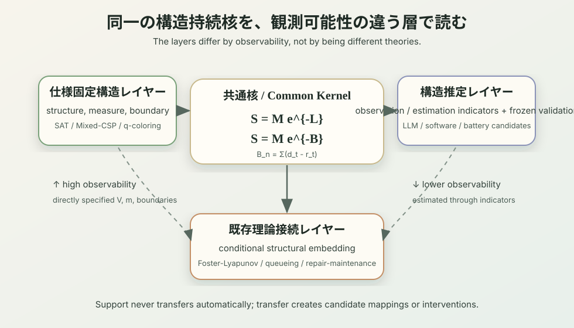

0_構造持続理論の統合版
構造持続理論の統合版
— 主理論の導線・構造持続の収支原理・二つの観測レイヤー —

要旨

本稿は、構造持続理論に関する既存の分冊を、一つの導線で読めるように再構成した統合版である。現在の主理論の導線は、「構造持続の最小形式」と「構造持続の収支原理」の二本である。前者は回復を明示しない最小核 \(S=Me^{-L}\) を与え、後者はそれを構造消耗量と回復量を含む \(S=Me^{-B}\) へ拡張する。ここで「最小形式」は、自明な予備段階という意味ではない。構造の喪失を資源枯渇ではなく維持可能領域の縮小として定式化し、対数比尺度の一意性と空虚化防止条件を切り出すことが、本稿群の第一の非自明な主張である。条件つき導出は、主線ではなく補論として、この最小核がどの条件で恒等式となり、どこから弱依存境界になるかを支える。LLM 推論劣化と継続学習忘却を扱う分冊は、その主理論核を観測困難な現実系へ写した推定レイヤーの観測的アンカーとして位置づける。

理論の最小核では、構造維持可能な状態集合の逐次縮小を対数比で測ることで、残存可能性が指数型で表されることを与える。したがって、指数型は追加仮定ではなく、この表現の帰結である。これは世間一般で暗黙に共有されていた前提を言い直したものではなく、構造維持可能性を測度比として扱うための最小条件を明示した表現定理である。構造持続の収支原理では、この最小核を \(r_t=0\) の特例として含み、構造消耗量 \(d_t\) と回復量 \(r_t\) の差を純消耗量
\[
  b_t := d_t - r_t
\]
として扱う。対象期間の累積純消耗量 \(B:=\sum_t b_t\) に対して、読者向けには
\[
  S = M e^{-B}
\]
という看板式を取る。ここで \(B\) は、対象期間が文脈上固定されたときの累積純消耗量であり、最小形式の \(S=Me^{-L}\) を回復を含む形式へ拡張した同型の式である。厳密な有限時間地平では \(B_n:=\sum_{t<n}(d_t-r_t)\), \(S_n=M_n e^{-B_n}\) と書く。集合値核だけを見れば、
\[
  m(V^{(n)}) = m(V^{(0)}) e^{-B_n}
\]
が成り立つことを主導線に置く。

LLM 推論実験側では、長期対話の劣化を文脈長そのものではなく、未整理の矛盾蓄積として捉える。継続学習側では、前提更新に依存する知識の連鎖更新が失敗することを、構造的忘却として記述する。これらは主理論核そのものではなく、構造そのものを直接数えるのではなく、消耗側指標と回復側指標が観測量を予測するかを検査する推定レイヤーの補助アンカーである。さらに、これらの含意として、外部代謝、多層記憶、巻き戻し可能性を備えた持続知能アーキテクチャの方向を述べる。

経験的主張は、証拠強度ごとに分けて読む。現時点で最も硬い外部再実行済みの足場は、Mixed-CSP と q-coloring の二つの仕様固定パッケージである。ここで CSP は制約充足問題を指す。これに加えて、有限グラフの \(s\)-\(t\) 切断スペクトル信頼性、全域木持続性、二元消失通信路 (BEC) 上の有限線形符号復元は、CSP 以外の有限な仕様固定ドメインにおいて追加予測力または残差的な構造信号を示す。ただし、これらはまだ外部再実行級の証拠ではなく、任意の実ネットワーク、任意の符号、Shannon 限界、または \(M\) 側主張まで一般化するものではない。LLM 推論実験、継続学習実験、ソフトウェア側の診断は、推定レイヤーの観測的・操作的アンカーとして読む。詳細な数値、非支持の記録、無効実行、未完了の再現計画は証拠ダッシュボードと各分析ノートに委ねる。

本稿は、主理論の導線、仕様固定レイヤー、推定レイヤー、既存理論接続属性、実装含意を一つの見取り図として提示するための入口であり、詳細な導出と実験条件は各分冊および補論に委ねる。

なお、現在の内部文書構成と、公開時の論文単位は同じではない。内部では、本稿、最小形式、収支原理、仕様固定アンカー、推定レイヤー、証拠台帳を分けて管理する。一方で公開時には、本稿、最小形式、収支原理、主要な仕様固定アンカーを束ねて、基礎理論と仕様固定で閉じる部分を公開第一稿として読ませる構成が自然である。直接数えられない現実系での観測・推定指標、凍結検証、支持 / 非支持台帳は、証拠の性質が異なるため、公開第二稿として切り出す候補である。公開構成の編集計画は [`publication_plan.md`](publication_plan.md) に置き、公開第一稿の本文候補は [`20_public_first_draft.md`](20_public_first_draft.md)、公開第二稿の本文候補は [`22_public_second_draft.md`](22_public_second_draft.md) に置く。

1. はじめに

大規模言語モデルや長期運用される複雑系では、十分な資源が残っているように見えるにもかかわらず、時間とともに一貫性、機能、または設計意図が保てなくなることがある。対話システムでは、これは長い文脈の中で論理的一貫性が崩れる現象として現れる。継続学習では、前提更新後に依存知識が整合的に再編されず、破滅的忘却や構造的不整合として現れる。これらはしばしば別々の問題として扱われ、文脈長、容量、訓練不足といった表層的な要因に帰される。

本稿は、これらを構造持続系の問題として捉え直す。一般向けに言えば、系とは、何らかの機能や維持条件を持った構造であり、何を保てば同じものとして続いていると言えるかが定められた対象である。ここで中心に置くのは、系の状態そのものではなく、ある構造と両立し、その構造をなお維持できる状態の集合である。崩壊とは、単なる資源枯渇ではなく、その構造を維持できる領域が制約の蓄積によって縮小していくことである。推論時には、構造とは「与えられた前提や規則のもとで、論理一貫性を保って最後まで到達できること」である。継続学習時には、構造とは「更新された前提のもとで、依存知識が整合的に再編されていること」である。

この視点で問題にしているのは、基体そのものの消滅ではない。問題にしているのは、ある構造としての同一性や、その構造が担っていた機能が持続できるかどうかである。したがって、劣化や崩壊として観測されるものは、多くの場合、無への消失ではなく、別の構造への遷移、構造的再編、相転移として理解される。

この視点を形式化するため、本稿群は構造持続の最小核を導入する。事前固定された構造維持問題において、構造維持可能集合の縮小を対数比で測ると、集合値核として
\[
  m(V^{(n)}) = m(V^{(0)}) e^{-L_n}
\]
が望遠鏡積から従う。資源側の有効維持量 \(M\) を別途導入すれば、読者向けの構造持続ポテンシャルとして
\[
  S = M e^{-L}
\]
を得る。さらに回復、修復、冗長化、外部支援、巻き戻しを含む系では、構造消耗量 \(d_t\) と回復量 \(r_t\) の差
\[
  b_t := d_t-r_t
\]
を純消耗量とし、
\[
  B_n:=\sum_{t<n} b_t, \qquad S_n=M_n e^{-B_n}
\]
と書く。

本稿の主張は、あらゆる系が経験的に指数減衰する、ということではない。重要なのは、構造両立性を事前固定された測度比で読み、構造消耗を対数比として測るなら、指数核が表現定理と望遠鏡積の結果として現れる、という点である。ここで非自明なのは、望遠鏡積そのものではなく、構造の失敗を「基体が維持条件 \(G\) を担う系として持続できる領域」の縮小として読む座標を立て、\(G,V,m\)、段階列、時間地平を事前固定することで、経験的内容を持つ表現にする点である。個別ドメインごとに変わるのは核そのものではなく、その核に入る \(V,m,d_t,r_t,M\) をどの程度直接指定・観測・推定できるかである。

この整理から、本稿の中心的な見取り図が得られる。本理論は、同一の構造持続核を、観測可能性と操作化の違いに応じて二つの主分類で扱う。第一は、構造、測度、境界を仕様として事前固定できる仕様固定レイヤーである。第二は、構造を直接数えられず、観測・推定指標で検査する推定レイヤーである。この主分類は対象ドメインの固定ラベルではなく、主張単位または検証単位の分類である。これとは別に、一部の主張単位では、既存理論のドリフト、収支、階数、経路確率比、停止境界などと条件付きに接続できる。この既存理論接続は第三のレイヤーではなく、各主張に付随する属性として扱う。これは「構造は常にある」という主張ではない。維持対象・測度・観測単位を固定できる場合に、その系を構造持続問題として扱う、という規律である。

外向けには、旧 Route 名ではなく次の二つの観測レイヤーと、主張単位に付く属性として読む。この配置は、補論「構造持続理論の構成地図」で示す読者向けの構成図に対応する。

| 種別 | 名前 | 判定 | 主な役割 |
|---|---|---|---|
| 主分類 | 仕様固定レイヤー | 維持条件、測度（維持可能領域の大きさを測るものさし）、境界を仕様から直接固定できる | 定理、有限時間境界、凍結済み検証パッケージの強い検証 |
| 主分類 | 推定レイヤー | 構造そのものは直接数えず、観測・推定指標と凍結検証で推定する | 現実系での追加予測力、診断、介入候補の検査 |
| 属性 | 既存理論接続 | 既存理論のドリフト、収支、階数、経路確率比、停止境界などと条件付きに接続できる | Foster-Lyapunov、待ち行列、符号理論、信頼性理論などとの形式的対応 |

この表の単位はドメイン全体ではなく、主張単位または検証単位である。同じドメインでも分類は分かれうる。二つの観測レイヤーに共通する語彙は、構造維持可能集合 \(V\)、測度 \(m\)、構造消耗量 \(d_t\)、回復量 \(r_t\)、累積消耗量 \(L\)、累積純消耗量 \(B\)、および外側の有効維持余力 \(M\) である。読者向けには \(S=Me^{-L}\), \(S=Me^{-B}\) と書けるが、仕様固定レイヤーで最も硬い定理側の核は、事前固定された \(V,m\) 上の集合値核である。

本稿では、直接観測される量を観測指標、観測量から構成される近似量を推定指標と呼び、両者を総称して観測・推定指標と呼ぶ。

したがって、普遍法則候補として評価するのは、まず仕様固定レイヤーである。ここでは \(V,m\)、時間地平、更新列、崩壊境界が事前固定され、仕様固定側の定理、有限時間境界、限定クラス普遍性を問うことができる。一方、推定レイヤーでは、同じ \(L\) または \(B\) の座標を \(\hat L,\hat B\) や操作的な読み出し量として近似し、\(M\) は有効維持余力を表す資源側のスカラーとして別に読む。このレイヤーは普遍法則そのものではなく、数学的に固定された座標を観測困難ドメインへ移す工学的推定レイヤーである。推定指標が構造座標をよく近似していることが凍結検証で確認されるほど、単なる説明語彙ではなく、崩壊、回復、設計変更後の評価量を予測する装置に近づく。ただし、その近似度と価値は、凍結後に「ドメイン基準モデル + 構造持続指標」がドメイン基準モデル単独を改善するか、あるいは非支持 / 沈黙として記録されるかによってのみ判定される。

このうち仕様固定レイヤーの定理側アンカーとして、有限 CSP の一次モーメント崩壊境界、二次モーメント存続境界、BEC 消失ランク復元境界を別補論に置く。BEC 側では、消失数が検査行数を超えると一意復元不能になる有限の逆向き境界、ランダム検査行列の行数スラック境界、消失数集中包絡との合成、および容量境界風の有限包絡も含む。これは経験的支持でも、任意 CSP の鋭いしきい値定理でも、BEC 容量定理でもなく、\(L\) が非空性や一意復元という独立した操作的判定対象に接続する最小例である。

この分類を支える数学的な見方は、構造維持問題の間の許容写像である。名前変更や測度保存同型では \(B_n\) は不変であり、正のゲージ変更では \(B_n\) は共変する。一方、粗視化や観測指標による推定では一般に不変性は失われるため、許容条件、誤差境界、または凍結後の追加予測力で評価する。詳細は補論「構造持続における許容写像と階層的不変量」に置く。

Lean 形式化では、仕様固定レイヤーと既存理論接続属性をまたいで現れる限定クラス統一インターフェースも登録している。ベルヌーイ型 CSP、Foster-Lyapunov / 待ち行列、修復・保守型モデルの三つの登録済み限定クラスは、順序つき累積量、非負傾向の駆動構造、有限時間証明経路、許容写像による転送条件からなる共通インターフェースを満たす。この位置づけは、任意ドメインに対する単一の普遍不等式を宣言するものではない。仕様固定レイヤーや既存理論接続属性を持つクラス単位の法則候補を、同じ構造持続語彙で登録し、追加クラスを検査可能にするための共通インターフェース閉包である。

本稿の経験的アンカーは、主に二つの方向からこの見取り図を支える。第一に、Mixed-CSP と q-coloring は、仕様固定レイヤーにおける外部再実行済みの強い足場である。これに加えて、有限グラフの \(s\)-\(t\) 切断スペクトル信頼性、全域木持続性、有限 BEC 線形符号復元は、有限な非CSP仕様固定ドメインでも、構造持続座標が追加予測力または残差的な構造信号を持ちうることを示す。ただし、この第二群はまだ外部再実行級の証拠ではない。第二に、LLM 推論実験と継続学習実験は、構造そのものを直接数えない推定レイヤーの観測的アンカーである。これらは同じ強度の主張ではないが、構造消耗、回復、余力、代替経路を同じ語彙で扱う統一座標の価値を示している。

したがって、本稿の目的は、古典的な意味での単一普遍法則を宣言することではない。目的は、構造消耗、回復、維持余力、代替経路を同じ座標で扱い、探索的写像を凍結検証へ進め、あるドメインで得られた維持設計を別ドメインの検証可能な介入候補へ変換するための、構造化された研究プログラムを提示することである。主線は構造持続の最小形式から構造持続の収支原理へ進む。条件つき導出、許容写像、M の操作化、運用規律、実証アンカーは、この主線を誤読なく使うための補論として読む。

2. 最小理論

基体 \(X\) と維持条件 \(G\) を固定し、状態、行動、経路のいずれを数えるかを観測単位として固定する。そのうえで、\(G\) を維持できる状態・行動・経路の集合を
  V^(0)
とする。制約追加モデル
  V^(i) = V^(i-1) ∩ C_i
のもとでは、
  V^(0) ⊇ V^(1) ⊇ ... ⊇ V^(n)
という縮小列は命題として従う。より一般には、学習・修復・外部支援・巻き戻しのような再拡大過程もありうるため、本稿群ではこの縮小性を収縮モードに対する適用条件として読む。理論の主対象は、残存比率 ρ ∈ (0, 1] 上の構造消耗尺度 f : (0, 1] → [0, ∞) であり、集合対 A ⊇ B に対する構造消耗 D(A, B) = f(m(B)/m(A)) はその表現として読まれる。構造消耗尺度に対する自然な公理系（比率依存性、正規化、加法性、連続性）を置くと、f は対数比として一意に強制される（分冊 1 §3 の対数比の一意性定理）。単位規約 k = 1 のもとで、各段階の構造消耗は
  d_i = -ln( m(V^(i)) / m(V^(i-1)) )
となる。累積構造消耗量
  L_n = Σ d_i
に対して
  m(V^(n)) = m(V^(0)) e^{-L_n}
が恒等式として成り立つ。

したがって、指数型は経験的に当てはめた関数形ではなく、構造消耗測度の公理系から二段階で導かれる必然的な形式である。対数比の一意性は、Hartley (1928) / Shannon (1948) による情報量の特徴づけと同じ論法（Cauchy の関数方程式の連続解）を、確率測度ではなく構造維持可能性の測度 m に適用したものにあたる。加法性の要請（B3）は、独立サブシステムでの構造消耗が足し合わさるという示量性を自然な動機づけとして持ち、統計力学におけるエントロピーの示量性と同じ骨格を共有する。各ドメインは f 全域ではなく、そのドメインで実現される比率の部分集合を観測するものと位置づけられるため、離散的な測度空間で f の一部が未実現のまま残ることは理論の限界ではなく、f を各ドメインが部分的にサンプリングすることの反映として読む。この最小核に、有効維持余力 M を別に導入すれば、構造持続ポテンシャル
  S = M e^{-L}
を得る。ここで重要なのは、M が資源側、L が構造維持可能性の縮小側を表し、この二つを切り分けられることである。資源が残っていても構造が壊れる場合があり、逆に構造を保てる余地がなお残っていても資源不足で維持できない場合がある。

この最小理論が与える予測は、制約の個数そのものよりも、どの制約がどれだけ構造維持可能領域を削るかという「質」の差に関する順序予測である。以後の主理論層は、この最小核を回復量を含む構造持続の収支原理へ拡張し、各アンカーはその核をどの強度で具体化できるかを別々の文脈で問う。

この点は、同じ基体が別の構造として存続しうる場合にとくに重要である。たとえば同じ分子組成が液体・固体・気体として異なる相に現れるとき、何を維持すべき構造とみなすかによって、観測されるのは消滅ではなく相の遷移になる。本稿群が扱うのは、そのような「何として持続しているのか」を問うための最小骨格である。

3. 技術補論としての条件つき導出と理論の射程

最小理論の指数式そのものは、状態集合の縮小率を対数比で定義する限り恒等式であり、独立性を要しない。しかし、各段階構造消耗の生成過程を確率的にモデル化するときには、どこからが追加条件に依存するかを分けておく必要がある。

このため統合版では、三つの条件を区別する。第一に、制約が縮小方向に働くこと。これは制約追加モデルでは命題として従うが、より一般にはなお適用条件として読むべきものである。第二に、構造消耗を縮小率の対数比で測ること。ここまでで恒等式としての指数表現は成立する。第三に、段階構造消耗の生成過程に独立性または弱依存の制御を入れること。これは恒等式のためではなく、参照モデルに対して指数型の安定性を論じるための条件である。

この区別は理論の言い過ぎを避けるために重要である。本稿群が直接に言っているのは、「あらゆる実系で構造持続が厳密に指数減衰する」という強い普遍命題ではない。より正確には、「最小形式の指数型は定義の帰結であり、実系への適用では、どの測度を選び、どの制約がどの縮小率を持つか、またその生成過程がどこまで安定に制御されるかが問題になる」ということである。

さらに、この理論が経験科学として意味を持つためには、維持条件 \(G\)、構造維持可能領域 V^(0)、測度 m、制約列 {C_i}、時間地平 T が事前に操作可能な形で定義されていなければならない。ここで測度とは、構造維持可能領域の大きさを読むものさしである。もし観測後に都合のよい維持条件や測度を選び直してよいなら、任意の有限単調減少列に対して m(V^(i)) = s_i を満たす縮小列を構成でき、理論は事後的適合によって空虚化する。したがって本稿群の射程は、事前固定性・非自明性・表現安定性を満たす構造維持問題に限られる。

ここでいう事前固定性は、探索的な写像発見を禁止するものではない。現実ドメインでは、維持対象、測度、構造消耗指標、回復指標を探索的に発見する段階がある。その段階の結果は候補信号または候補写像であって、まだ支持ではない。支持と呼べるのは、写像・指標・データ分割・評価量・基準モデルを凍結した後、保留データ、将来データ、新規データ集合、または外部再実行で予測力の増分を示した場合に限られる。凍結後に外れたものは非支持、基準モデルと重複する弱い追加軸は弱軸写像失敗、測れない領域は沈黙として記録する。この運用規律は、補論「構造持続写像の標準手順」と補論「構造持続理論の運用規律」で定め、分析側では写像試行台帳として蓄積する。

このとき重要になるのが、構造粒度である。構造粒度とは、維持対象をどの細かさ・どの階層で定義するかを指す。全体の維持可能性は、最小構成要素の状態だけで決まるとは限らない。多くの系では、構造は入れ子状・多階層的であり、下位構造の消耗、上位構造の制約、階層間の依存、回復量の伝播が相互作用する。したがって、自然な \(V,m\) は単一の階層だけで固定されるとは限らず、維持条件に応じた構造粒度の設定と、多階層的な構造写像が必要になる。

したがって、この理論の強さは、指数型そのものではなく、個別ドメインにおいて基準モデルを上回る追加の予測力を持てるかどうかにかかる。さらに重要なのは、構造持続指標が常に最強の単独モデルになることではなく、既存専門モデルに対して追加的・横断的な予測座標を与えるかである。ここで構造持続指標とは、構造持続理論から導かれる構造消耗・回復・余力の指標群を指す。すなわち、構造持続理論の経験的価値は、しばしば構造持続指標だけがドメイン基準モデルを置き換えるかではなく、ドメイン基準モデルに構造持続指標を加えたとき、未使用データでドメイン基準モデル単独を改善するかで判定される。推論時の矛盾蓄積、継続学習時の前提更新、SAT における探索難度などは、その具体化候補として並んでいる。

この点で、数学的基盤の役割は、任意の観測・推定指標を自動的に正しくすることではない。むしろ、何を近似しているのか、どこで外れたのか、次にどの観測単位や読み出し量を改善すべきかを、\(L\) または \(B\) の構造座標と、資源側の \(M\) の上で評価できるようにすることである。推定レイヤーの推定指標は、構造座標をよく近似していることが凍結検証で確認されるほど予測装置として強くなりうるが、その昇格は凍結後の追加予測力によってのみ認められる。

この共通座標は、予測だけでなく設計にも効く。あるドメインで有効だった消耗の局所化、回復経路の保存、余白の保存、代替経路の保存は、別ドメインの候補介入を生成するための手がかりになる。ただし、その転用は支持の輸入ではない。A ドメインで効いた設計は、B ドメインにおける凍結検証可能な仮説を作るにすぎず、B ドメインでの支持は B 側の保留データ、将来データ、新規データ集合、または外部再実行で初めて成立する。

この意味で、本稿群の外向けの貢献は三つに要約できる。第一に、構造消耗、回復、余力、代替経路を同じ語彙で見る統一座標である。第二に、探索で見つけた構造写像を凍結し、既存モデルに構造持続指標を加えたときに未使用データでの予測力が改善するかを見る予測力の増分検証である。第三に、あるドメインで効いた維持設計を、別ドメインの候補介入へ変換するドメイン横断の設計転用である。凍結検証は第二の柱そのものではなく、予測力の増分を正当に判定するための方法論上の規律である。

長期的には、この実証部分は観測・推定指標エコシステムとして運用される。初期の仕様固定レイヤー、推定レイヤー、非CSP の観測・推定指標は、将来のより詳細な測定、直接の事象ログ、アクセス制限つきデータ、または外部監査つき評価によって置き換えられうる。ただし、置き換えは旧結果の上書きではない。旧指標は支持、非支持、弱化結果として履歴に残し、新しい指標は別版として凍結し、別データ、将来面、新規データ集合、または外部再実行で検証する。このルールにより、観測・推定指標の精度は改善し続けられるが、支持への昇格条件は狭く保たれる。

### 3.1 SAT における自然測度の固定

自然測度の問題を最初に最も硬く扱えるドメインは SAT である。ランダム 3-SAT では、状態空間を
\[
X_n := \{0,1\}^n
\]
とし、質量モデルを
\[
m_n(A) := |A|
\]
すなわち充足割当て候補の単純な数え上げとして固定できる。正規化された一様測度
\[
\bar m_n(A) := |A| / 2^n
\]
を用いても、対数比
\[
\log \frac{m_n(B)}{m_n(A)}
=
\log \frac{\bar m_n(B)}{\bar m_n(A)}
\]
では定数因子が打ち消し合うため、構造消耗および累積構造消耗量 \(L\) は不変である。したがって SAT では、観測者が都合よく質量モデルを選び直す自由度は実質的に残らない。

この固定のもとで、単一のランダム 3-clause が一様ランダム割当てを生き残らせる比率は \(7/8\) であり、\(m=\alpha n\) 個の節に対して
\[
L = \alpha n |\ln(7/8)|
\]
が直接に定まる。ゆえに SAT は、構造持続理論における自然測度の候補が最初から仕様の内部に埋め込まれている仕様固定レイヤーの基準例として位置づけられる。

Lean 形式化では、この SAT 側の基準ドメインについて、有限時間地平・独立同分布の悪事象曝露モデルの範囲で、基準的な SAT 鎖を凍結している。具体的には、節曝露の経路測度、悪事象の加法的汎関数、経路確率から導かれる母関数積、Chernoff / KL 型の下側尾部境界、および崩壊時刻境界までが接続されている。詳細な主張と定理の対応表は `lean/PAPER_MAPPING.md` に統合する。この凍結範囲は、無限時間地平、ほとんど確実なエルゴード定理、適応的な節選択、ソルバーの動力学を含まない有限地平線の基準線である。

この位置づけを明確にすると、SAT は本稿群における数学的アンカーである。すなわち、自然測度、一次モーメント、実際の経路測度、Chernoff / KL 境界までが、ランダム 3-SAT の問題設定から機械検証済みの鎖として得られる。一方で、推論実験は経験的アンカーであり、構造矛盾が文脈長や制約数だけの基準モデルを越える追加予測力を持つことを示す。非CSPの工学・物理・情報例は、この二つと同じ強さの新規予測としてではなく、古典的な骨格が最小語彙で歪まず表せるかを見る健全性確認・被覆確認として扱う。

この SAT アンカーは、Mixed-SAT / NAE-SAT の有限 CSP 実験によって一段拡張された。単一ファミリーでは \(L=m\ell\) となり生の制約数と縮退するが、3-SAT と 3-NAE-SAT ではドリフトが \(\log(8/7)\) と \(\log(4/3)\) で異なる。2026-04-22 の事前登録済み主要検査では、12,000 インスタンスすべてが正常に完走し、構造損失を含む特徴量が、生の制約数だけの特徴量を大きく上回った（対数損失 0.0970 対 0.7525）。これは普遍法則の最終宣言ではないが、ベルヌーイ型 CSP クラス内で \(L\) が制約の質を運ぶ座標として機能することの経験的支持である。

### 3.2 構造持続の集合値力学的表現への拡張

ここまでの議論は、回復を明示しない最小モードとしてすでに十分に整理されている。しかし本稿群自身が認めているように、現実の系では、学習・修復・冗長化・外部支援・巻き戻しのような再拡大作用が支配的になる局面もある。この点を明示的に扱うためには、制約追加モデル
\[
V^{(i)} = V^{(i-1)} \cap C_i
\]
を構造持続の集合値力学的表現の特例として位置づけ直す必要がある。

そのための最小拡張として、各時刻 \(t\) における更新を、収縮作用 \(K_t\) と再拡大作用 \(R_t\) の合成
\[
V_t^- := K_t(V^{(t)}), \qquad
V^{(t+1)} := R_t(V_t^-)
\]
で与える。ここで \(K_t\) は構造維持可能領域を削る作用、\(R_t\) は修復・学習・外部支援等によってその領域を押し広げる作用を表す。このとき、構造消耗量
\[
d_t := - \log \frac{m(V_t^-)}{m(V^{(t)})}
\]
と回復量
\[
r_t := \log \frac{m(V^{(t+1)})}{m(V_t^-)}
\]
を同じ対数尺度で定義できるので、純消耗量
\[
b_t := d_t - r_t
\]
は
\[
b_t = - \log \frac{m(V^{(t+1)})}{m(V^{(t)})}
\]
と書き直せる。したがって累積純消耗量 \(B_n := \sum_{t=0}^{n-1} b_t\) に対して
\[
m(V^{(n)}) = m(V^{(0)}) e^{-B_n}
\]
が再び望遠鏡積として成り立つ。

重要なのは、この式が従来の指数核を捨てるのではなく、むしろそれを符号付き純消耗量へ拡張している点である。もし各時刻で \(R_t = \mathrm{id}\) なら \(r_t = 0\) となり、\(B_n\) はそのまま収縮モードの累積構造消耗量 \(L_n\) に戻る。したがって、収縮モードは構造持続の集合値力学的表現の内部に埋め込まれた特例として読める。補論「構造持続の集合値力学的表現と符号付き指数核」では、この拡張を定義・命題・限界の形でより系統的に述べる。

4. 構造持続の収支原理

構造持続の収支原理は、最小形式の核を、回復を含む主理論層へ持ち上げる。条件つき導出は、その背後の技術補論として読む。中心にあるのは、構造消耗量 \(d_t\) と回復量 \(r_t\) の差し引き
\[
  b_t = d_t - r_t
\]
を純消耗量として扱うことである。累積純消耗量
\[
  B_n = \sum_{t<n} b_t
\]
に対して
\[
  m(V^{(n)}) = m(V^{(0)}) e^{-B_n}
\]
が成り立つ。資源項を明示する読者向けの表では、同じ内容を
\[
  S = M e^{-B}
\]
と書く。これは、構造持続の最小核 \(S=Me^{-L}\) や、収縮だけを扱う \(m(V^{(n)})=m(V^{(0)})e^{-L_n}\) を捨てるのではなく、\(r_t=0\) の特例として回収する。

この構造持続の収支原理では、\(b_t>0\) は構造消耗優位、\(b_t=0\) は維持、\(b_t<0\) は回復優位を表す。したがって、ここでいう「収支」は均衡ではなく会計である。崩壊、維持、回復を同じ符号付き量の三つの局面として読むための座標である。

確率過程として扱う場合には、\(\mathbb E[b_t]\) の符号が期待値レベルの傾向を与える。ただし、これは高確率の崩壊境界ではない。有限時間の崩壊境界や hitting-time bound を主張するには、bounded increments、MGF product、Chernoff / KL、margin 条件などの追加構造が必要である。この切り分けにより、仕様固定レイヤーの定理的主張と推定レイヤーの観測的主張を混同しない。

したがって、本稿群の主理論核は二段で読むのがよい。第一に、構造持続の最小形式が \(S=Me^{-L}\) の核を与える。第二に、構造持続の収支原理が、構造消耗量と回復量を含む \(S=Me^{-B}\) へ拡張する。条件つき導出と弱依存境界は補論であり、主線の理解後に降りればよい。以下の推論実験と継続学習実験は、この核の証明ではなく、推定レイヤーの補助アンカーとして読む。

5. 推定レイヤーの補助アンカー I: 推論時の構造劣化

推論側の分冊では、長い対話で起きる劣化を、単なる文脈長の問題としてではなく、未整理の矛盾や更新が蓄積することで、有効な推論経路の集合が縮小していく過程として記述した。ここでいう有効経路とは、与えられた前提や規則に反せず、自己矛盾なく最後まで到達できる粗い推論段階列の集合である。

この設定では、構造的な矛盾、指示衝突、時間的な不整合、参照元どうしの衝突、未整理の上書きなどが制約として働き、
  A^(0) ⊇ A^(1) ⊇ ... ⊇ A^(n)
という有効経路集合の縮小を生む。したがって、経路集合の残存量もまた最小理論と同じ指数形式で表される。

実験では、矛盾する更新を外部で検出し、「旧値 -> 新値」の時間ラベルつき対として整理・保持する条件を ON、同じ矛盾を注入しつつその整理を行わない条件を OFF、矛盾注入なしを NC とした。観測された主結果は、ON が OFF を安定して上回り、OFF が NC を下回るという方向である。gemma3:27b（n=3、180 ターン）では規則＋事実の合算で ON 73.3%、NC 56.7%、OFF 21.1%（ON vs OFF p = 0.0004, Cohen's d = 8.80）であった。ここから得られる最小の経験的主張は、長期対話の劣化は単に長さだけでは説明しにくく、未整理の矛盾が有力な制約源になっている、という点である。

加えて、外部代謝を含まない単発推論実験では、GPT-4.1-nano / mini と Gemini Flash Lite の 3 モデル × 計 810 試行にわたり、256K トークンのフィラーを含む長文脈よりも、32K 文脈に混入した構造的矛盾のほうが正答率を大きく削る逆転が一貫して観測された（GPT-4.1-mini で 256K フィラーのみ 97% に対し 32K + 構造矛盾 0%）。この逆転は、制約の個数や文脈長だけで累積構造消耗量を予測する基準モデルでは説明できない方向であり、$L$ が制約の質を区別する必要があること、すなわち構造持続の枠組みが基準モデルに対する追加予測力を持つことの経験的証拠を与える。
Exp.39 の 2×2 prospective replication でも、同じ主比較は GPT-4.1-nano で再現された。zero / 32K は 29/30、zero / 256K は 19/30、structural / 32K と structural / 256K はともに 0/30 であり、主比較 \( \mathrm{acc}(32K,\ structural) < \mathrm{acc}(256K,\ zero) \) は成立した。

この分冊の役割は、主理論核そのものを与えることではない。少なくとも論理一貫性維持という限定された観測量に関して、構造持続の枠組みが基準モデルに対する追加予測力を持つことを、上記の 810 試行の逆転、範囲指定を修復として使う条件、追加検査段階での ON/OFF 差として示す推定レイヤーの補助アンカーである。

6. 推定レイヤーの補助アンカー II: 継続学習時の構造的忘却

継続学習側の分冊では、忘却を単に「古い事実を思い出せないこと」としてではなく、前提更新に依存する知識の連鎖更新が失敗し、内部状態が新旧の知識を混在させた不整合になることとして捉えた。これを構造的忘却と呼ぶ。

たとえば「会社 X の本社は東京である」が「大阪である」に更新されたなら、最寄駅、通勤路線、配送区域など、その前提に依存する知識も同時に組み替えられなければならない。上流の前提だけが更新され、下流が古いまま残るなら、それは単なる旧知識喪失ではなく、構造的再編の失敗である。

この問題に対し、分冊では低ランク適応 (LoRA) ベースの逐次学習を用い、過去再提示の基準条件 E-lite、前提依存構造を追跡する F-v2c、現在知識と過去知識を別アダプタに分ける F-multi を比較した。結果は、全モデル・全条件で最初の前提更新以降に旧知識保持が急減し、LoRA が蓄積というより上書きに近く振る舞うことを示した。F-v2c は依存整合性を改善するが旧知識保持忠実度は低く、F-multi は非ゼロの旧知識保持を与えるものの、高忠実度の長期保持にはなお届かない。

この分冊の役割も、主理論核そのものを与えることではない。推論側で扱った「未整理の矛盾が経路を削る」という話を、学習側では「前提更新が依存構造を壊す」という別の相として示す推定レイヤーの補助アンカーである。共通点は、どちらも構造維持可能領域が縮小し、それを補う修復・支援設計が必要になることにある。

7. 実装含意

理論と実験が指しているのは、単にモデルを大きくすればよい、あるいは訓練レシピを改善すればよい、というだけの方向ではない。少なくとも本稿群が扱った現象は、未整理の矛盾を抱えたまま、外部状態を持たずに長期運用される連想機械の限界を示唆している。

そこから出てくる設計含意は、外部代謝、多層記憶、巻き戻し可能性である。外部代謝とは、矛盾する更新を「古い状態」と「新しい状態」の関係として外で整理し、未整理の上書きのまま会話や学習に残さないことである。多層記憶とは、作業記憶、活性ルール、休眠知識、事実データ集合を分け、同じ形式ですべてを抱え込まないことである。巻き戻し可能性とは、代謝や更新が失敗したときに、局所的に復元できることである。

この含意は LLM に閉じない。ソフトウェア工学における冗長性、クリーンアーキテクチャ、インターフェースと契約、継続的検査、巻き戻し、観測可能性は、構造消耗を局所化し、回復経路を残し、変更後も維持可能な経路集合を枯らさないための実践的プロトタイプとして読める。同じ座標に写すことで、あるドメインの成功例は、別ドメインにおける設計候補を生成する。たとえば範囲づけを修復として使う設計は責任境界や変更範囲の明示へ、依存関係を意識した再提示は上流変更に伴う下流判断の再同期へ、巻き戻しは局所復元可能性の設計へ翻訳できる。

この方向のソフトウェア側拡張として、ソフトウェア契約整合性診断は、ソフトウェア崩壊そのものを直接測るものではなく、より手前の「分散契約矛盾」を検出する操作的トラックとして位置づける。ここでいうソフトウェア構造とは、API と呼び出し側、設定と実行時、文書と実装、既定値の生成側と消費側、ライフサイクル上の生成側と消費側など、複数の面にまたがって保たれる契約集合である。DeltaLint はこのトラックの現在の実装名であり、理論上の対象そのものではない。

このトラックには二つの証拠層がある。第一に、2026 年 3 月中旬の外部 OSS 現場実演では、DeltaLint の作業手順から生成された候補を人間が選別・再現・修正し、外部リポジトリへ PR / Issue として提出した。その結果、Microsoft / Facebook / Bytedance / Sentry / coder / tRPC などを含む 12 リポジトリで 16 件の PR が取り込まれた。これは未選別の生検出に対する適合率・再現率実験ではない。候補選別、修正しやすさ、PR 戦略、保守者側の文化、Claude Code による修正補助、人間の再現・交渉が混ざるためである。しかし、実在プロジェクトの保守者レビューを通ったという意味で、DeltaLint の作業手順が実運用上有用な分散契約矛盾候補を生成しうることを示す現場実演・保守者受理証拠である。

第二に、契約整合性ベンチマークは、同一モデル・同一凍結文脈・同一時間制限の下で、一般レビューと構造レンズ付きレビューを比較し、有界検証後の一意で妥当な構造的根本原因が増えるかを見る制御ベンチマークである。2026-04-29 時点のプロダクト側較正では、五つの凍結 OSS 項目のうち四つで追加利得があり、同一範囲・加算規則の下で九つの妥当な構造的根本原因が追加として認定された。したがって、これが通っても直ちに「ソフトウェア崩壊を予測した」とは言わない。言えるのは、構造持続の座標が、崩壊の前駆シグナルである分散契約矛盾の検出に操作的価値を持つ、という限定された主張である。

同じ規律は、本稿群自身の書き方にも現れる。主理論の導線、関連分冊、補論、Lean 形式化での対応、数値的な健全性確認、非支持 / 沈黙判定を分けることは、理論プログラムを検証可能・保守可能・拡張可能な構成物として扱うための方法論である。

この方法論は、将来の実証エコシステムにも拡張される。すなわち、各ドメインで観測・推定指標を発見し、凍結し、結果を支持 / 非支持 / 弱軸 / 沈黙として共有台帳に残し、より強い測定が可能になったときに版を分けて再検証する。生データを公開できない場合でも、アクセス制限つきデータ、封印された保留データ、信頼された実行者、秘匿化された結果カードによって、検証可能性を残したまま観測・推定指標の昇格と棄却を蓄積できる。

この方向は、長期的な一貫性を持つ知能システム、すなわち内部モデルを育てながら持続するパートナー型知能を考えるときに自然である。記憶を増やすことそのものよりも、矛盾をどう解消し、何を休眠させ、いつ再活性化し、どこまで安全に戻せるかが中心になるからである。

8. 限界と今後の課題

本稿群は、構造持続理論のすべてを証明したものではない。最小形式の指数型は定義の帰結であり、その意味で骨格は明確だが、各ドメインで何を構造維持可能状態とみなすか、どの測度で比較するか、どの観測・推定指標が最もよいかはなお個別課題として残る。

推論実験について言えば、現時点で強く言えるのは ON > OFF と OFF < NC の方向であり、ON が常に NC を上回ることまで一般化するのは早い。継続学習実験について言えば、LoRA ベース逐次更新という一つの更新様式の限界を示したのであって、あらゆる訓練手法を尽くしたわけではない。また、構造的忘却の記述はなお操作的であり、内部表現そのものを直接観測しているわけではない。したがって LLM 推論劣化と継続学習忘却の分冊は、主理論核ではなく、構成上は推定レイヤーの補助アンカー、証拠強度としては観測的アンカーとして読む。

それでも、本稿群の価値は、推論劣化と継続学習忘却を別々の現象として終わらせず、どちらも構造維持可能性の縮小として読む一つの言語を与えた点にある。今後の課題は、この言語を仕様固定レイヤー、推定レイヤー、既存理論接続属性のそれぞれで鍛えることである。

9. 結論

本稿は、構造持続理論に関する既存の分冊を統合し、主理論核と実証アンカーの役割を整理した。構造持続の最小形式は、構造維持可能領域の縮小から最小核 \(S=Me^{-L}\) が現れることを与える。構造持続の収支原理は、これを構造消耗量と回復量を含む形式へ拡張し、回復を含む場合には累積純消耗量 \(B\) による \(S=Me^{-B}\) が構造維持可能性を支配することを主導線に置く。条件つき導出は、その指数型がどこまで定義の帰結で、どこからが追加条件に依存するのかを分ける技術補論である。LLM 推論劣化と継続学習忘却の分冊は、未整理の矛盾や前提更新が構造を削り、範囲指定、外部代謝、依存関係に基づく再同期が回復側指標として働くことを示す推定レイヤーの補助アンカーである。

したがって、本稿群の中心主張は次のように要約できる。長期的な知能システムの劣化を理解する鍵は、単なる容量不足や長さそれ自体ではなく、維持条件 \(G\) を担う系として持続できる領域がどのような制約によって削られていくかを見ることにある。そこから自然に導かれる設計方向は、矛盾を外部で代謝し、内部モデルを壊れにくく保つ持続知能アーキテクチャである。

より一般には、本稿群の貢献は、崩壊しない系を無条件に作る方法を与えることではない。むしろ、崩壊しにくく、改修可能性を失いにくく、局所的に修復できる構造を設計するための共通座標を与えることである。構造消耗、回復、余力、代替経路を同じ語彙で扱えるため、あるドメインで効いた維持設計を、別ドメインの凍結検証可能な介入候補へ変換できる。

ここで失われるのは、存在一般ではなく、「その構造として持続すること」である。この整理を置いておくことで、崩壊、忘却、相転移、再編といった異なる観測現象を、同じ骨格の別相として読むことができる。

本稿群の経験的主張のうち、現時点で最も硬い外部再実行済みの足場は、仕様固定レイヤーの Mixed-CSP と q-coloring である。Mixed-CSP では、3 名の外部実行者が同一の凍結済み検証パッケージを再実行し、いずれも 12,000 行の主要出力、確認対象の核心項目不一致 0、支持判定フラグすべて真を返した。q-coloring でも、3 名の外部実行者が同一の凍結済み検証パッケージを再実行し、いずれも 4,000 行の主要出力、確認対象の核心項目不一致 0、時間切れ 0、形式不正 0、および同じ定性的支持判定を返した。これにより、仕様固定レイヤーの二つの凍結済み検証パッケージはどちらも、3 名全員で判定が再現された外部再実行として記録された。

定理側では、有限確率質量関数 (PMF) 上の一次モーメント崩壊境界に加えて、二次モーメント比が制御できる場合の存続側境界も Lean 側に切り出されている。ただし、これは任意 CSP の鋭いしきい値定理ではない。

これに加えて、有限な非CSP仕様固定ドメインでは、全域木持続性、有限グラフの \(s\)-\(t\) 切断スペクトル信頼性、有限 BEC 線形符号復元が、それぞれ限定された検証面上で支持または支持相当の構造信号を示している。これらは、CSP 以外でも \(V,m\) を仕様から固定できる場合に、構造持続座標が空虚な言い換えに留まらないことを支える。ただし、この群はまだ外部再実行級の証拠ではなく、任意のネットワーク信頼性、任意の符号、Shannon 限界、または実運用系一般への主張ではない。

LLM 推論劣化と継続学習忘却の観察は、推定レイヤーの観測的アンカーであり、仕様固定レイヤーの有限時間定理鎖と同じ強度ではない。このうち推論実験については、同一モデル内の 2×2 再現実験が主方向を再確認している。したがって本稿群の証拠状態は、外部再実行済みの仕様固定CSP足場、有限非CSP仕様固定支持、推定レイヤーの観測的アンカーを分けて読むべきである。

10. 詳細への案内

本稿は入口であり、詳細は各分冊に委ねる。読み順としては、構成地図、統合版、主理論の導線を押さえ、その後に仕様固定レイヤーと推定レイヤーを読み、必要に応じて既存理論接続属性を持つ補論へ進むのが最も誤読が少ない。全体の層と依存関係は補論「構造持続理論の構成地図」、支持判定と沈黙条件は補論「構造持続理論の運用規律」にまとめる。

- 構成地図・運用規律: 補論_構造持続理論の構成地図.md, 補論_構造持続理論の運用規律.md
- 主理論核（先に読む）: 1_構造持続の最小形式.md, 2_構造持続の収支原理.md
- 技術補論（必要に応じて読む）: 補論_構造持続の条件つき導出.md, 補論_構造持続の収支原理の詳細展開.md
- 推定レイヤー / LLM補助アンカー: `03_domains/02_structurally_inferred/llm_reasoning_degradation.md`, `03_domains/02_structurally_inferred/continual_learning_forgetting.md`
- 証拠状態の現在スナップショット: `05_evidence/evidence_status_dashboard.md`
- 仕様固定レイヤー / CSP・非CSP有限アンカー: 補論_計算コストの構造的予測.md, 補論_有限CSPにおける構造持続の予測力.md, [仕様固定レイヤーにおける操作的定理](../02_foundations/27_specification_fixed_operational_theorems.md), `03_domains/01_specification_fixed/st_cut_spectrum_reliability.md`, `03_domains/01_specification_fixed/graph_spanning_tree_persistence.md`, `03_domains/01_specification_fixed/coding_channel_recovery.md`
- 開放系・写像・M（有効維持余力）: [構造持続の集合値力学的表現と符号付き指数核](../02_foundations/23_set_valued_dynamics.md), [構造持続における許容写像と階層的不変量](../02_foundations/22_admissible_maps.md), [構造持続写像の標準手順](../04_operations/50_standard_mapping_procedure.md), [構造持続における M（有効維持余力）の操作的定式化](../04_operations/52_resource_M.md)
- 非CSP / 既存理論アンカー: 補論_構造持続の収支原理とFoster-Lyapunovドリフトの形式的埋め込み.md, 補論_非CSP古典例における構造持続の収支原理の最小アンカー.md
