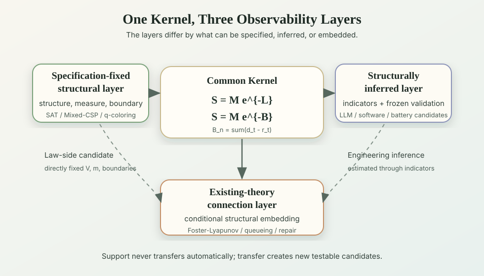
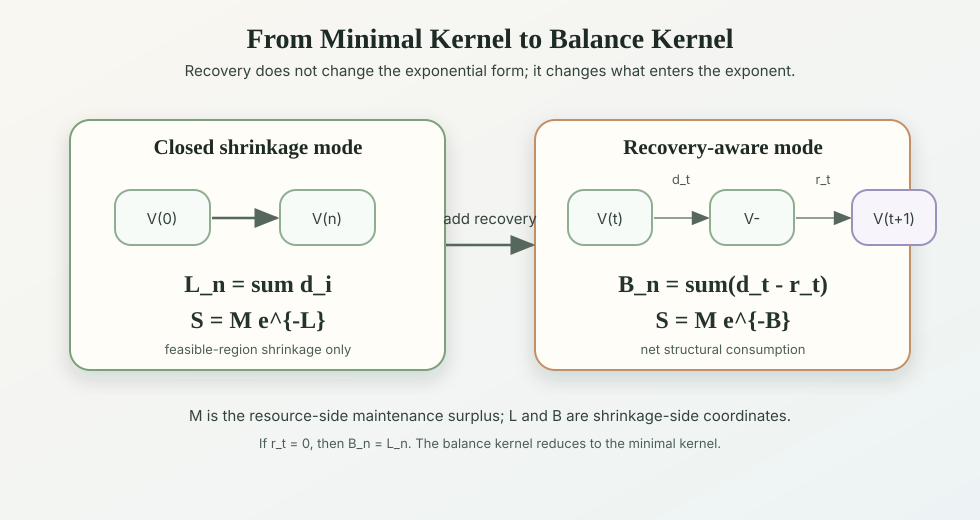

Core_Structural_Persistence_Minimal_Kernel_and_Balance_Principle_EN
Structural Persistence: Minimal Kernel and Balance Principle
Feasible-region shrinkage, log-ratios, exponential kernels, and recovery-aware persistence

Abstract

A structure can become unmaintainable even when resources remain. This paper separates that failure into a resource-side effective maintenance surplus \(M\) and the shrinkage-side coordinate \(L\) or \(B\), which reads the region in which a substrate can continue as a system bearing the maintenance condition \(G\).

This paper is a reader-facing synthesis of two companion theoretical papers: *The Minimal Form of Structural Persistence* and *The Balance Principle of Structural Persistence*. The precise axioms, proofs, and limitations remain those of Paper 1 / Paper 2 and the corresponding technical supplements.

In the closed shrinkage case, a pre-fixed feasible region \(V\) and ruler \(m\) yield the exponential kernel \(e^{-L}\) by reading survival ratios on a logarithmic scale. With the resource-side scalar \(M\) made explicit, the structural persistence potential is written \(S=Me^{-L}\).

For open systems with repair, recovery, reconfiguration, or external support, each time step has structural consumption \(d_t\) and recovery \(r_t\). Their difference \(b_t=d_t-r_t\) accumulates to \(B_n\), giving the recovery-aware form \(S_n=M_n e^{-B_n}\). The novelty is not the exponential notation itself. It is the pre-fixed coordinate that separates resource-side surplus from feasible-region shrinkage, making it possible to describe how a structure becomes unmaintainable even when resources remain.

1. Role of this paper

This paper is the integrated reading path for the main theoretical spine.

| Document | Role |
|---|---|
| Paper 0 | Whole-program map: two observability layers, connection attributes, evidence, Lean, supplements |
| This Core Paper | Reader-facing synthesis of Paper 1 and Paper 2 |
| Paper 1 | Strict spine for measuring shrinkage, log-ratio uniqueness, telescoping product, and the minimal kernel |
| Paper 2 | Strict spine for two-step updates, recovery, net consumption, and the balance principle |

This paper is therefore not a replacement for the companion papers. It is the shortest public path through them.

Paper 1 is not merely "obvious." It fixes the structural maintenance feasible region supporting the maintenance condition \(G\). It then shows that, if shrinkage is measured by a scale that composes additively over chained survival ratios, the log-ratio scale is unique. It also explains why post-hoc choices of the feasible set or ruler \(m\) would make the formalism empty.

2. The question

This theory does not begin by projecting abstract mathematics onto reality. In businesses, organizations, institutions, software development and maintenance, learning systems, and reasoning systems, a structure can become unmaintainable even when resources and slack still remain. The starting question of this paper is whether that phenomenon can be formalized not as simple resource shortage, but as shrinkage of the region in which a substrate can continue as a system bearing the maintenance condition.

This paper first calls the substrate or state space cut out for analysis \(X\). This is not a natural kind uniquely given by science in general. It is an object whose boundary, state description, and observation unit have been fixed for the analysis. When asking about structural persistence, this substrate \(X\) is treated as a structural maintenance problem \(\Pi=(X,G)\), where \(G\) is the function, relation, identity, or structural condition to be maintained.

The condition \(G\) is what must be maintained for the substrate \(X\) to count as that system. Before defining the feasible region, the observation unit fixes which states, actions, or paths are being counted. The relevant region is the region of targets that satisfy \(G\), or that can maintain or recover \(G\) under allowed repair, update, or operation. This paper calls that region the structural maintenance feasible region.

Intuitively, an organization may still have people and budget, yet lose the coherent decision conditions or executable procedures that let it continue to function as that organization. Software may still run and have compute resources, yet lose the states, edits, or recovery paths in which changes remain coherent or recovery remains available. What is lost is not existence in general, but the region of states, actions, or paths in which the target can continue as a system bearing the maintenance condition \(G\).

More concretely, this paper asks whether shrinkage of the structural maintenance feasible region can be used as a descriptive coordinate reusable across domains.

The boundary at which a target can no longer continue as a system bearing \(G\), namely the structural maintenance boundary for \(G\), may appear differently across domains: collapse, functional failure, operational halt, phase transition, or structural reorganization. These are not treated as separate universal phenomena. Under a pre-fixed structural-maintenance map, they may be read as different manifestations of the same boundary. What can be separated is the route to that boundary. One route is shrinkage of the feasible region, read through \(V\) and the \(L\) or \(B\) coordinate. Another route is exhaustion of effective maintenance surplus \(M\), which may appear as failure or halt even when some feasible structural region remains. The minimal kernel formalizes the former and keeps \(M\) explicit as the resource-side effective maintenance surplus.

Thus the question is not simply how much resource remains, but how the structural maintenance feasible region supporting \(G\) changes under constraints, contradictions, damage, updates, disturbances, repair, or reconfiguration.

This question splits into two parts.

1. Without recovery, how should we measure shrinkage of the region in which the target can continue as a system bearing \(G\)?
2. With recovery, how should structural consumption and recovery be balanced on the same scale?

Paper 1 answers the first question. Paper 2 answers the second. This paper connects them.

3. What must be fixed before measuring structure

Fix a substrate \(X\) and a maintenance condition \(G\). Also fix, as the observation unit, whether states, actions, or paths are being counted. Write the resulting comparison-target space as \(\Omega_X\). If only states are counted, \(\Omega_X=X\).

Let \(V_G\subseteq\Omega_X\) be the set of targets that satisfy \(G\), or that can maintain or recover \(G\) under allowed repair, update, or operation. Whether \(V_G\) is read as the set of current states satisfying \(G\), or as a set of actions or paths that include allowed operations, must be fixed with the observation unit \(\Omega_X\). If \(V_G\) is a state set, recovery-induced expansion is placed in the later \(r_t\) term. If \(V_G\) is an action or path set, the allowed operation is already being counted, and the same recovery should not be counted again. Likewise, each application must pre-fix whether resource conditions required for allowed operations are included in \(V_G\) or kept outside as the effective maintenance surplus \(M\). When the context is clear, write this simply as \(V\). Write the initial feasible region as \(V^{(0)}\). Under accumulating constraints,
\[
V^{(0)} \supseteq V^{(1)} \supseteq \cdots \supseteq V^{(n)}.
\]

A ruler \(m\) is fixed to compare the sizes of these feasible regions. Mathematically, \(m\) is a finite measure; reader-facing, it is the convention used to read the size of a target set. It may be counting measure in a finite system, probability mass under a pre-fixed distribution, volume or weighted volume in a continuous state space, or another pre-specified finite measure. If a coordinate transform or feature extraction changes the meaning of \(m\), that map must also be fixed in advance. The detailed discipline for choosing this ruler and freezing the corresponding map is only summarized here; it is specified in Section 13 and the v3 operations files.

The nontrivial step is not the act of taking a logarithm. It is fixing, before seeing the outcome, under which maintenance condition \(G\), which target set counts as the feasible region \(V_G\), and which ruler \(m\) is used to read its mass. The same observed system can yield different \(L\) values if one post-hoc switches between a consistency set, a success set, or a function-maintenance set. If \(G\), \(V\), or \(m\) can be chosen after seeing the data, almost any monotone sequence can be represented and the theory loses empirical content. This pre-fixing of \(G\), \(V\), \(m\), the stage sequence, and the time horizon is therefore not a bookkeeping prelude; it is what turns the formalism into an empirical claim.

All log-ratios below are read on positive finite masses. Hitting zero is treated separately as a collapse boundary, not as an ordinary finite log-ratio update.

As the simplest specification-fixed example, consider a finite CSP. Let \(X\) be the set of all candidate assignments, let \(V^{(i)}\) be the candidate set satisfying the first \(i\) constraints, and let \(m(V)=|V|\) be the number of candidates. Then \(d_i\) reads how much constraint \(i\) removed from the maintainable candidate set. If relaxation or repair expands the candidate set again, that expansion is read, in Paper 2, as \(r_t\) on the same log-ratio scale.

4. How to measure shrinkage

Let \(r\in(0,1]\) be a survival ratio. A structural consumption scale \(f(r)\) should depend on the already-realized ratio, not on the absolute mass. The composition requirement is not a probabilistic independence assumption about how constraints are generated.

It is a measurement requirement. If a shrinkage path factors as
\[
\frac{m(V^{(2)})}{m(V^{(0)})}
=
\frac{m(V^{(1)})}{m(V^{(0)})}
\frac{m(V^{(2)})}{m(V^{(1)})},
\]
then the measured consumption should add:
\[
f(r_1r_2)=f(r_1)+f(r_2).
\]

Overlap, dependence, and redundancy among constraints are already absorbed into the actual feasible sets \(V^{(i)}\) and the ratios \(m(V^{(i)})/m(V^{(i-1)})\). The additivity axiom concerns the scale used to measure those ratios.

Together with normalization and continuity, this functional equation forces
\[
f(r)=-k\log r,
\qquad k>0.
\]
Taking \(k=1\) fixes the unit. The stage consumption is
\[
d_i
=
-\log\frac{m(V^{(i)})}{m(V^{(i-1)})}.
\]

5. Accumulating survival ratios yields the exponential kernel

Define cumulative structural consumption by
\[
L_n=\sum_{i=1}^{n} d_i.
\]
Then the intermediate ratios cancel in a telescoping product:
\[
m(V^{(n)})=m(V^{(0)})e^{-L_n}.
\]

This is not the empirical claim that every real system decays exponentially. It is a representation theorem: once a pre-fixed feasible region is measured through log-ratios, the exponential kernel follows algebraically.

The law-side kernel is therefore \(e^{-L}\). Introducing the resource-side term \(M\), the structural persistence potential is
\[
S=Me^{-L}.
\]
Here \(S\) is the structural persistence potential for the target structural condition. In general, it is not itself a probability or a physical observable; it is a comparison quantity defined under pre-fixed choices of \(M,V,m\), and the boundary convention. Reaching \(S=0\), or a pre-fixed threshold \(S\le S_c\), means reaching the structural maintenance boundary for that condition. For finite \(L\) or \(B\), \(e^{-L}\) and \(e^{-B}\) remain positive, so \(S=0\) is read mainly as \(M=0\), a zero-mass boundary, or a limiting boundary. This is not the empirical claim that physical collapse must occur. Observationally, the boundary may appear as collapse, functional failure, halt, phase transition, or structural reorganization, depending on the domain.

The term \(M\) is not derived from the exponential kernel. It represents the resource-side effective maintenance surplus available for the target structural condition, and is treated here as a pre-fixed resource-side readout. This does not assume that \(M\) and the structural-side coordinate \(L\) or \(B\) vary independently in the real dynamics. A shortage of effective maintenance surplus can act as a constraint that affects future feasible regions \(V\), recovery terms \(r_t\), cumulative net consumption \(B\), or observed boundaries. The structural maintenance boundary can be reached through the feasible-region route represented by \(L\), the resource-side route represented by \(M=0\), or both. The novelty is not predicting the internal composition of \(M\); it is separating feasible-region shrinkage as \(L\), apart from the resource-side term \(M\).

6. What changes when recovery is included

Open systems may repair, restore, buffer, reroute, roll back, or reconfigure. A time step can therefore be read as a two-step update:
\[
V_t^- := K_t(V^{(t)}),
\qquad
V^{(t+1)} := R_t(V_t^-).
\]

Here \(K_t\) is the shrinkage action and \(R_t\) is the recovery action within the fixed observation unit.

The following ratios are also read only when the denominator and numerator masses are positive and finite. Hitting zero is treated as a collapse boundary rather than as an ordinary log-ratio update.

Define
\[
d_t
=
-\log\frac{m(V_t^-)}{m(V^{(t)})},
\qquad
r_t
=
\log\frac{m(V^{(t+1)})}{m(V_t^-)}.
\]
In the standard two-step reading, \(m(V^{(t+1)})\ge m(V_t^-)\), so \(r_t\ge0\). Then
\[
b_t=d_t-r_t
=
-\log\frac{m(V^{(t+1)})}{m(V^{(t)})}.
\]

The intermediate set cancels in the log-ratio accounting. This cancellation is an accounting identity for a given start point, intermediate point, and endpoint. It is not a claim that the physical order of consumption and recovery never matters. If changing the order changes the endpoint \(V^{(t+1)}\), then \(b_t\) changes as well. What is order-invariant here is the log-ratio reading, not the underlying dynamics.

If reconfiguration changes the target structural condition itself, the old and new structures may not be directly comparable with the same ruler. In that case, a common map or common embedding must be fixed in advance before the two structures are read in the same coordinate.

7. The balance kernel

Define
\[
B_n=\sum_{t<n}b_t.
\]
The same telescoping argument gives
\[
m(V^{(n)})=m(V^{(0)})e^{-B_n}.
\]
With the resource-side term,
\[
S_n=M_n e^{-B_n}.
\]

If recovery exceeds cumulative consumption, then \(B_n<0\) and \(e^{-B_n}>1\). Under the pre-fixed ruler \(m\), this means that the feasible region has expanded beyond the initial reference level.

If there is no recovery, then \(r_t=0\), \(b_t=d_t\), and \(B_n=L_n\). Thus the balance kernel does not replace the minimal kernel. It extends it.

The central point is simple: in recovery-aware systems, persistence is governed not by consumption alone, but by net consumption.

8. Accounting is not equilibrium

The word "balance" means accounting, not equilibrium. The signs of \(b_t\) give local accounting regimes on a pre-fixed observation unit.

| Condition | Reading |
|---|---|
| \(b_t>0\) | consumption-dominant |
| \(b_t=0\) | locally maintained |
| \(b_t<0\) | recovery-dominant |

These regimes are grain-relative. If two adjacent intervals are merged,
\[
b_{[t,t+2]}
=
-\log\frac{m(V^{(t+2)})}{m(V^{(t)})}
=
b_t+b_{t+1}.
\]
The cumulative quantity \(B_n\) is additively coherent under time aggregation, but regime labels and hitting boundaries depend on the pre-fixed observation unit. A path that is "consumption followed by recovery" at a fine grain may appear locally maintained at a coarser grain.

9. Kernel modes, two observability layers, and connection attributes

This paper separates two distinctions.

The first distinction is the mode of the structural-persistence kernel. In the closed shrinkage mode, the stepwise shrinkage of the feasible region is measured by
\[
d_i=-\log\frac{m(V^{(i)})}{m(V^{(i-1)})},
\]
and the cumulative structural consumption \(L_n=\sum_i d_i\) gives
\[
m(V^{(n)})=m(V^{(0)})e^{-L_n}.
\]
When recovery, repair, redundancy, external support, or rollback are made explicit, the net consumption is
\[
b_t=d_t-r_t,
\]
and \(B_n=\sum_{t<n}b_t\) gives
\[
m(V^{(n)})=m(V^{(0)})e^{-B_n}.
\]
Thus the difference between \(L\) and \(B\) is not an observability-layer difference. It is the difference between reading shrinkage without explicit recovery and reading net consumption with recovery. If \(r_t=0\), then \(B_n\) reduces to \(L_n\).

The second distinction concerns observability, operationalization, and claim strength. The same kernel is read first through two observability layers.

| Main classification | Reading |
|---|---|
| Specification-fixed layer | The maintenance condition \(G\), comparison-target space \(\Omega_X\), feasible region \(V_G\), ruler \(m\), update sequence, boundary, and time horizon can be fixed directly from the specification |
| Inference layer | \(V_G\) and \(m\) are not directly counted; observation or inference indicators are frozen and tested |

These are not different theories, and they are not fixed labels for domains. They classify claim packages or validation packages, not whole domains. The difference is how directly \(V,m,d_t,r_t\) can be specified and how explicitly the effective maintenance surplus \(M\) can be read as a resource-side quantity.

Separately, some claim packages have an existing-theory connection attribute. This means that existing drift, balance, rank, path-ratio, hitting-bound, or stability quantities can be mapped conditionally into this paper's variables. This is not a third layer; it is an attribute attached to a particular claim package.

| Attribute | Reading |
|---|---|
| Existing-theory connection | A specific quantity, difference, boundary, or assumption-conditioned theorem in an existing theory corresponds formally to this vocabulary |
| Analogy only | The vocabulary or intuition is similar, but no formal correspondence is claimed |
| No current connection claim | No connection to an existing theory is claimed at present |

In the specification-fixed layer, the theorem-side kernel is not the full \(S\)-formula including the resource term \(M\). It is the set-valued kernel on pre-fixed \(V,m\):
\[
m(V^{(n)})=m(V^{(0)})e^{-L_n},
\qquad
m(V^{(n)})=m(V^{(0)})e^{-B_n}.
\]
The formulas \(S=Me^{-L}\) and \(S=Me^{-B}\) should be read as structural persistence potentials obtained by placing the resource-side effective maintenance surplus \(M\) outside that set-valued kernel.

In specification-fixed models, this set-valued kernel can also connect to operational endpoints. For finite CSPs, a first-moment loss fixed by the exposure model gives a one-sided bound on non-emptiness. For BEC binary linear codes, the erasure-rank loss \(a(E)\log 2\) reads the unique-recovery boundary exactly. These are theorem-side anchors, not empirical support claims: they show that \(L\) can connect to independently defined collapse or recovery endpoints.

In the inference layer, observation and inference indicators such as \(\hat L\), \(\hat B\), contradiction, dependency breakage, or contract coherence are candidate readouts of the law-side coordinates, not the coordinates themselves. Strong or incremental support is assigned only after freezing the mapping, indicators, split, metric, and domain baseline, and only if the model with structural-persistence indicators improves over the domain baseline on unused data. Failed mappings are recorded as no-support, and unmeasurable cases as silence.

The existing-theory connection attribute is, more strictly, a conditional structural embedding. It is not an intermediate strength level between the two observability layers. It is a lateral bridge: existing drift, difference, hitting-bound, and stability conditions are mapped conditionally into vocabulary such as \(d_t,r_t,b_t,B_n\).

For example, in A06/A19, erasure-rank accounting is a specification-fixed exact anchor, the frozen prediction test based on low-order dependency pressure belongs to the inference side, and the rank correspondence to coding theory is an existing-theory connection attribute. The same domain can therefore appear in different rows depending on the claim package being discussed.

The fact that \(L\) and \(B\) are dimensionless log-ratios, readable in natural-log units, does not by itself justify quantitative comparison across domains. Cross-domain comparison becomes meaningful only under pre-fixed maps specifying \(V\), the ruler \(m\), the observation unit, and the boundary in each domain. Under those conditions, \(L\) and \(B\) provide candidate common coordinates for shrinkage and recovery.

As the approximation improves, the structural persistence coordinates move from explanatory vocabulary toward predictive instrumentation. This is an empirical achievement, not something granted by the notation.

10. What the Lean formalization covers

The Lean formalization does not prove the entire theory. Its role is to check the algebraic skeleton used by the main theory and the common interface used by registered limited classes.

The key point is that three different registered limited classes--Bernoulli-CSP, Foster-Lyapunov / queueing, and Repair-Maintenance--are checked in Lean as satisfying the same unifying interface. This is not a single universal inequality for all systems. It is a machine-checked fact that multiple law-side candidate classes can be organized under the same structural-persistence vocabulary.

The core Lean-covered parts are, roughly:

1. the minimal algebra behind log-ratios, telescoping products, and the exponential kernel;
2. the balance algebra using \(d_t\), \(r_t\), \(b_t=d_t-r_t\), and \(B_n\);
3. the fact that registered limited classes such as Bernoulli-CSP, Foster-Lyapunov / queueing, and Repair-Maintenance satisfy a common unifying interface.
4. small specification-fixed operational anchors: the finite-PMF first-moment collapse bound \(\Pr[Z>0]\le\mathbb E[Z]\) and the BEC erasure-rank accounting identity \(L_E=a(E)\log 2\).

Lean does not by itself prove that every domain has a natural feasible region \(V\), ruler \(m\), or observation unit. It also does not prove that structurally inferred indicators approximate the true \(L\) or \(B\), which real resource should be read as \(M\), that an empirical package obtains outside-rerun support, or that a single universal law holds for all systems.

Thus Lean supports the law-side skeleton. Empirical support and structurally inferred validity are still judged by frozen validation, holdout tests, outside reruns, and the support / no-support / silence discipline.

11. Evidence status

The current evidence and theorem-side anchors should be read by strength.

- **Theorem-side anchors, not empirical evidence**: in the specification-fixed layer, finite CSPs provide a small first-moment collapse bound, and BEC binary linear codes provide an erasure-rank unique-recovery boundary. The first states that a pre-fixed \(L_n^{\mathrm{FM}}\) gives a one-sided bound on non-emptiness; the second states that \(L_E=a(E)\log 2\) reads the unique-recovery boundary exactly. These are not predictive wins or outside reruns. They are the minimal specification-fixed answer to the concern that \(L\) is only a post-hoc name.
- **Hard evidence**: the hard footing lies in the specification-fixed layer. Mixed-CSP and q-coloring each have frozen empirical packages with three outside rerunners reproducing decision-relevant outputs. Mixed-CSP has 12,000 primary rows per returned run, 0 checked core mismatches, and reproduced support flags. q-coloring has 4,000 primary rows per returned run, 0 checked core mismatches, TIMEOUT = 0, MALFORMED = 0, and the qualitative support decision reproduced. This is not a proof of the whole theory, but it is the strongest current package-scoped outside-rerun support for the law-side candidate.
- **Specification-fixed non-CSP finite-network support**: A12 \(s\)-\(t\) cut-spectrum reliability tests whether the pre-fixed low-order cut-spectrum pressure \(\log(1+H_{\mathrm{cut},2})\) adds predictive value to a natural graph baseline under fixed finite graphs, terminals, independent edge failures, and a fixed collapse boundary. The first v0 package is recorded as an invalid run because the \(\kappa=3\) generation surface was too thin, but the successor \(\kappa=2\) and \(\kappa=3\) surfaces both passed their frozen primary gates. Relative log-loss improvement was 1.66% for \(\kappa=2\) and 2.09% for \(\kappa=3\), with paired graph-id bootstrap positive rate 1.0 in both packages. This is additional specification-fixed finite-network support outside CSP; it is not support for arbitrary \(\kappa\), real networks, exact reliability superiority, A31 spanning-tree persistence, or the \(M\)-side term.
- **Specification-fixed finite coding-channel support**: A06/A19 coding-channel recovery tests whether the pre-fixed low-order parity-check column-dependency pressure \(\log(1+H_{\mathrm{dep},4})\) adds predictive value to a natural coding baseline under fixed binary linear codes, a BEC erasure law, and the rank-defined unique-recovery boundary. In primary v0, the rank accounting audit and label/sample audit passed on 240 codes, 960 code/\(q\) rows, and 245,760 erasure samples. Relative log-loss improvement was 2.11%, with paired code-id bootstrap positive rate 1.0. This is specification-fixed support on the finite BEC sparse parity-check surface; it is not Shannon-capacity theorem support, arbitrary-code support, non-BEC support, final-rank oracle support, exact failure-probability superiority, or \(M\)-side validation.
- **Auxiliary and exploratory evidence**: in the inference layer, LLM reasoning, continual learning, and software diagnostics provide evidence through frozen observation and inference indicators. The question there is whether the indicators add information beyond the domain baseline, not whether the true \(V,m,L,B\) have been directly counted.
- **Existing-theory connection attribute**: Foster-Lyapunov / queueing, Repair-Maintenance, reliability, and decay systems contain claim packages that map existing drift, difference, and boundary arguments into the structural-persistence vocabulary. This is an attribute of those claims, not a third observability layer, and it is not a new empirical win.
- **Evidence ledger**: Backblaze, C-MAPSS, Scania, Oxford battery, and the M-flow network testbed belong to the ledger of support, weakening, and no-support. They are recorded to preserve where the framework works, weakens, or fails.

12. What this makes possible

The value of this core paper is not merely that it places two formulas side by side. The coordinate makes it possible to separate routes to unmaintainability into a resource-side route and a feasible-region shrinkage route.

First, the theory separates the support side from the shrinkage side. The familiar resource-side term is kept as effective maintenance surplus \(M\), while the loss of states compatible with the target structural condition is read as \(L\), or as \(B\) when recovery is present. This makes it possible to read collapse, functional failure, halt, phase transition, and structural reorganization as possible manifestations of a structural maintenance boundary, while still distinguishing the route by which that boundary is reached.

Second, \(L\) and \(B\) provide candidate common coordinates for structural consumption and recovery across domains. They are dimensionless log-ratios, readable in natural-log units when \(k=1\). This unit convention alone does not justify cross-domain comparison. Comparison becomes meaningful only under pre-fixed maps specifying \(V\), the ruler \(m\), the observation unit, and the boundary in each domain.

Third, the framework separates where law-side claims are made from where observation or inference indicators are tested. The specification-fixed layer can support law-side claims. The inference layer tests whether frozen indicators add predictive information beyond the domain baseline. Existing-theory connection is recorded as a claim-level attribute when existing theories are mapped to the same vocabulary. This separation keeps support, no-support, and silence distinct.

Fourth, the empirical question is not whether structural-persistence indicators are always the strongest standalone model. Many domains already have strong domain baselines. The central test is whether
\[
\text{domain baseline}+\text{structural-persistence indicators}
\]
improves over the domain baseline alone under frozen out-of-sample conditions.

Fifth, the coordinate gives a language for design transfer. Localization of consumption, preservation of recovery paths, preservation of safety margin, and preservation of alternative paths can become candidate interventions in another domain. What transfers is not support itself. Support in the new domain must be established by freezing the map, indicators, baseline, metric, split, and decision rule, and then testing on held-out data, future data, a fresh archive, or an outside rerun.

13. Minimal operational discipline

This paper does not reproduce the full procedure for mapping structural persistence into a concrete domain. The detailed procedure is kept in the v3 operations files: the standard mapping procedure, operational discipline, support levels, and failure ledger. Here we state only the minimal discipline needed to read this core paper.

The theory separates mapping discovery from validation. A structural condition, ruler, observation or inference indicator, or recovery indicator found during exploration is not support by itself. Support is assigned only after the structural condition, mapping, indicators, baseline, metric, data split, and decision rule have been frozen, and only if the frozen rule succeeds on unused data, a future surface, a fresh archive, or an outside rerun.

If coarse-graining, reconfiguration, or action order can change the readout of endpoints or boundaries, the observation unit, common map, embedding, and decision boundary are also part of what must be frozen.

In the specification-fixed layer, one first fixes the substrate or state space \(X\), the maintenance condition \(G\), the comparison-target space \(\Omega_X\), the feasible region \(V_G\), the ruler \(m\), the observation unit, the time horizon, and the structural-maintenance boundary. In the inference layer, one does not claim to directly count the true \(V,m,L,B\); one tests whether frozen observation or inference indicators add information beyond the domain baseline. Existing-theory connection is recorded as an attribute of a claim package when existing differences, drifts, stopping boundaries, or stability conditions are mapped into the \(L\) and \(B\) vocabulary.

A frozen mapping that fails is recorded as no-support. It is not promoted to support by retuning the indicator or boundary on the same data. Failures are kept as a ledger of where a mapping failed and where the theory should remain silent.

14. Conclusion

The law-side minimal kernel is \(e^{-L}\). With resource-side effective maintenance surplus made explicit, the structural persistence potential is
\[
S=Me^{-L}.
\]
The recovery-aware balance kernel replaces \(L\) by cumulative net structural consumption \(B\):
\[
S=Me^{-B}.
\]

At the specification-fixed layer, the hardest theorem-side kernel is the set-valued accounting kernel on pre-fixed \(V,m\). The formulas \(S=Me^{-L}\) and \(S=Me^{-B}\) are structural persistence potentials obtained by connecting the resource-side surplus \(M\) to that kernel.

There are at least two routes to unmaintainability. The first is shortage of effective maintenance surplus \(M\). The second is shrinkage of the structural maintenance feasible region \(V_G\) supporting the maintenance condition \(G\). The contribution of this paper is to provide the minimal coordinate for reading these two routes without conflating them.
