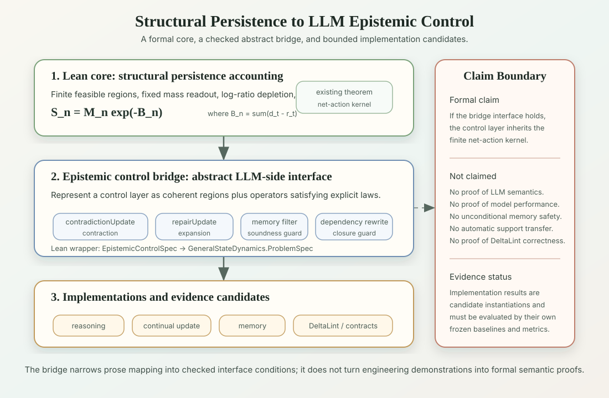
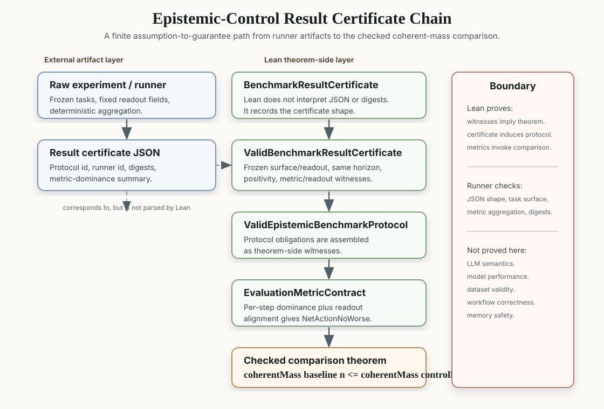

LLM Epistemic Control Bridge
============================

domain_id: llm_epistemic_control_bridge

domain_name: LLM epistemic control bridge

classification: inference

status: formal_bridge


1. Role
-------

This note records the reader-facing meaning of
`lean/Survival/EpistemicControlBridge.lean` and the implementation-boundary
schema in `lean/Survival/EvidencePacketBridge.lean`.

The bridge does not formalize natural-language semantics, model weights,
attention dynamics, or LLM performance.  It formalizes a narrower interface:
if an LLM control layer can be represented as a finite epistemic state space
with a coherent region, a mass readout, a contradiction update, and a repair
update satisfying the stated contraction / expansion laws, then the existing
structural-persistence net-action kernel applies to that abstract control
layer.

The bridge therefore sits between:

- the Lean core: finite regions, log-ratio accounting, contraction / repair,
  and signed exponential kernels;
- the epistemic-control bridge and evidence-packet bridge: abstract
  contradiction / repair operators plus provenance, eligibility, witness,
  dependency-closure, and repair guardrails;
- the finite toy strengthening layer: dependency-closure cardinality budgets,
  lifecycle memory guards, provenance trust ordering, minimal contradiction
  witnesses, and composed repair wrappers;
- the software evidence net-action bridge: eligible evidence, shared-key
  witness soundness, dependency repair coverage, and valid protocol witnesses
  sufficient to invoke the comparison theorem;
- the LLM inference-layer profiles: reasoning degradation, continual-learning
  structural forgetting, and long-term memory control;
- the implementation / experiment layer: contradiction metabolism,
  dependency-aware refresh, memory qualification, and software
  contract-coherence diagnostics.






2. Lean Objects
---------------

The bridge is intentionally thin.  Its central structure is
`EpistemicControlSpec X`, where `X` is the type of complete epistemic
configurations.  The bridge does not prescribe whether `X` is represented by
claims, assumptions, provenance labels, dependency graphs, memory records, or
implementation traces.

The mathematically relevant fields are:

| Lean object | Reading |
|---|---|
| `initialRegion` | initially coherent / feasible epistemic configurations |
| `massModel` | pre-fixed mass readout over epistemic regions |
| `contradictionUpdate` | contraction step induced by contradiction, unscoped update, or unsafe admission |
| `repairUpdate` | repair / expansion step induced by scoping, contradiction metabolism, dependency refresh, or controlled readout |
| `contradiction_contracts` | the contradiction update is a contraction |
| `repair_expands` | the repair update expands from the post-contraction region |

The bridge then defines `toProblemSpec`, which converts this interface into the
existing `GeneralStateDynamics.ProblemSpec`.  This conversion is the main point:
the LLM-side object is not a new theory; it is an instance-shaped wrapper for
the already verified contraction / repair kernel.


3. Theorem Map
--------------

The main checked statements are:

| Lean theorem | Meaning |
|---|---|
| `contradiction_update_is_contraction` | contradiction update contracts the current feasible epistemic region |
| `repair_update_is_repair` | repair update expands from the post-contradiction intermediate region |
| `contradiction_update_mass_le_current` | contradiction update cannot increase mass at the contraction substep |
| `repair_update_mass_ge_contradiction` | repair update has at least the post-contradiction mass |
| `epistemicNetAction_eq_contradictionLoss_sub_repairGain` | epistemic net action is `d_t - r_t` |
| `epistemic_control_composition_kernel` | coherent epistemic mass follows the existing signed exponential net-action kernel |
| `controlled_coherentMass_ge_baseline` | a same-initial-mass controlled layer with no larger cumulative net action preserves at least the baseline coherent mass |
| `metric_net_action_no_worse` | per-step loss / repair metric dominance witnesses the no-worse cumulative net-action premise when metric sums match the bridge readout |
| `metrics_controlled_coherentMass_ge_baseline` | evaluation metrics, readout alignment, positivity, and same initial mass invoke the coherent-mass baseline comparison |
| `benchmark_protocol_implies_net_action_no_worse` | a valid benchmark protocol invokes the metric witness for no-worse net action |
| `benchmark_protocol_implies_controlled_mass_ge_baseline` | a valid benchmark protocol invokes the end-to-end coherent-mass baseline comparison |
| `result_certificate_implies_benchmark_valid` | a valid result certificate induces a valid benchmark protocol |
| `result_certificate_implies_net_action_no_worse` | a valid result certificate invokes the no-worse net-action premise |
| `result_certificate_implies_controlled_mass_ge_baseline` | a valid result certificate invokes the coherent-mass baseline comparison |
| `eligibility_filter_no_more_loss_under_soundness` | a sound memory filter incurs no more log-ratio loss than an accept-all policy under the stated region-containment premise |
| `dependency_rewrite_localizes_under_sound_closure` | a sound rewritten dependency closure localizes semantic invalidation inside graph downstream closure |
| `evidence_filter_no_more_loss` | an evidence eligibility gate inherits the bridge-level admission loss comparison |
| `evidence_invalidations_localized` | evidence dependency packets localize semantic invalidations through a sound closure |
| `repair_touches_invalidations` | a repair covering the dependency closure also covers semantic invalidations |
| `llmReasoningToy_composition_kernel` | a finite LLM reasoning toy inherits the net-action kernel |
| `staleMemory_not_eligible` | a stale unscoped memory packet is rejected by the eligibility gate |
| `eligibleMemory_no_more_loss` | a toy LLM memory admission gate inherits the no-more-loss comparison |
| `memory_without_permission_not_eligible` | a toy memory without permission is rejected by the use-condition gate |
| `deleted_memory_not_eligible` | a deleted toy memory is rejected by the use-condition gate |
| `out_of_scope_memory_not_eligible` | an out-of-scope toy memory is rejected by the use-condition gate |
| `useConditionMemory_no_more_loss` | the explicit use-condition memory gate inherits the no-more-loss comparison |
| `premiseUpdate_invalidations_localized` | a toy premise update localizes downstream invalidations |
| `repairTouches_downstreamInvalidations` | a toy refresh repair covers the premise-update invalidations |
| `llm_invalidated_ncard_le_repair_touched_ncard` | localized toy LLM invalidations are bounded by the touched repair surface budget |
| `revokedScopedMemoryRecord_not_eligible` | a revoked lifecycle memory record is rejected |
| `expiredScopedMemoryRecord_not_eligible` | an expired lifecycle memory record is rejected |
| `lifecycleMemory_no_more_loss` | lifecycle memory admission inherits the no-more-loss comparison |
| `retrieval_packet_cannot_overwrite_userCorrection_packet` | lower-trust retrieval provenance cannot overwrite a user-correction packet in the toy trust order |
| `reasoningContradictionWitness_minimal` | the toy reasoning contradiction witness is exactly a two-surface witness |
| `llm_composed_repair_kernel` | composed toy repair still inherits the finite net-action kernel |
| `toyEvidenceAdmission_no_more_loss` | the software toy admission gate instantiates the evidence-packet admission comparison |
| `toyRepair_touches_invalidations` | the software toy repair packet covers localized toy invalidations |
| `software_invalidated_ncard_le_repair_touched_ncard` | localized toy software invalidations are bounded by the touched repair surface budget |
| `software_evidence_implies_net_action_no_worse` | eligible toy software evidence plus dependency repair coverage and a valid benchmark protocol invokes the no-worse net-action premise |
| `software_evidence_implies_controlled_mass_ge_baseline` | the same software evidence package invokes the coherent-mass baseline comparison |

The composition theorem is the non-decorative part of the bridge:

```text
coherentMass S n =
  coherentMass S 0 * exp (-(cumulativeEpistemicNetAction S n))
```

under the same finite positivity assumptions used by
`GeneralStateDynamics.PositiveTrajectory`.

`EpistemicControlComparison.lean` adds the finite baseline-comparison reading:

```text
NetActionNoWorse controlled baseline n
  -> coherentMass baseline n <= coherentMass controlled n
```

provided the two layers start with the same coherent mass and both satisfy the
finite positivity assumptions.  This is a control-accounting comparison, not a
claim that any real model has lower net action.

`EpistemicControlEvaluationContract.lean` then gives an evaluation-facing
witness contract:

```text
controlledLoss_t <= baselineLoss_t
baselineRepair_t <= controlledRepair_t
metric sums match cumulative net actions
  -> NetActionNoWorse controlled baseline n
```

This says which loss / repair readouts can witness the comparison premise.  It
does not prove that a benchmark, implementation, or model output supplies a
valid readout.

`EpistemicBenchmarkProtocol.lean` fixes the protocol obligations needed before
such metrics can be used:

```text
frozen task surface
frozen readout
same finite horizon
same initial coherent mass
metric dominance
readout alignment
  -> coherentMass baseline n <= coherentMass controlled n
```

This prevents the bridge from silently absorbing after-the-fact metric choices.
It still does not validate a real benchmark, dataset split, or decision rule.

`EpistemicBenchmarkResultCertificate.lean` adds a theorem-side certificate
layer for external result artifacts:

```text
protocol-shape witness
frozen task surface and readout
same finite horizon and same initial mass
positive trajectories
metric dominance
readout alignment
  -> coherentMass baseline n <= coherentMass controlled n
```

It does not parse JSON or certify the external runner. It states which
certificate witnesses are sufficient to reuse the benchmark-protocol theorem.

The first named toy result artifact,
`../../05_evidence/llm_epistemic_control_frozen_toy_v0/llm_epistemic_control_frozen_toy_v0_result_001.json`,
exercises this certificate loop on the deterministic frozen toy packet. It is
still protocol-shape evidence only, not validation evidence for a real model or
workflow.

The real-eval candidate mapping note,
`../../05_evidence/llm_epistemic_control_real_eval_candidate_mapping.md`, maps
existing implementation-side logs to candidate future witnesses for premise
update, memory qualification, benchmark-audit discipline, and software evidence
packaging. It does not retrospectively convert existing logs into support.

The first frozen real-eval candidate surface,
`../../05_evidence/llm_epistemic_premise_update_v0/`, fixes 12 premise-update /
dependency-staleness tasks and their stale / updated marker readout before
outcome-bearing execution. It contains no model outputs and no support
decision.
The companion scorer / schema,
`../../../analysis/epistemic_control_premise_update_v0/`, can turn externally
supplied baseline / controlled outputs into a result-certificate-shaped
summary, but it does not call a model or validate model performance.
The output collection rule,
`../../05_evidence/llm_epistemic_premise_update_v0/output_collection_protocol_v0.md`,
fixes the raw-output JSONL procedure before any result artifact is promoted.
The first run manifest,
`../../05_evidence/llm_epistemic_premise_update_v0/run_manifest_result_001.md`,
fixes the model, prompts, runtime options, and planned output artifacts for
the first output-bearing run.
The completed result artifact,
`../../05_evidence/llm_epistemic_premise_update_v0/llm_epistemic_premise_update_v0_result_001.md`,
has protocol-local decision `silence`, so it does not instantiate a valid
benchmark result certificate or support the coherent-mass comparison theorem.

A v1 premise-update redesign is recorded as a new external witness / readout
surface:
`../../05_evidence/llm_epistemic_premise_update_v1/`. It may narrow the v0
marker-silence failure by freezing a more explicit slot-state readout before
outcome-bearing execution, but it must not retroactively change v0. The Lean
certificate fields are unchanged: v1 still has to supply frozen-surface,
frozen-readout, same-horizon, same-initial-mass, positivity, metric-dominance,
and readout-alignment witnesses before the coherent-mass comparison theorem is
invoked. A future v1 package is promotable only when its result has
`decision = support_clean`, `protocol_shape_valid = true`, and
`promotable = true`; `support_with_ambiguity`, `mixed_inconclusive`,
`silence`, and `invalid_run` are audit outcomes, not theorem-side support.

The layer boundary is:

| Layer | It proves or checks | It does not prove |
|---|---|---|
| Lean theorem layer | supplied witnesses imply the benchmark protocol and coherent-mass comparison | LLM performance or natural-language semantics |
| Runner layer | JSON shape, task-surface identity, metric aggregation, and dominance flags | semantic correctness of model outputs |
| Frozen benchmark manifest | predeclared task surface, readout, horizon, and decision rule | universal performance or transfer to another domain |
| Named toy result artifact | deterministic toy result for the frozen packet | real-model validation or operational support |
| Real-eval candidate mapping | possible future witness sources and remaining freeze obligations | support evidence or retrospective validation |
| Premise-update frozen surface | predeclared setup / update / probe task surface and marker readout | model-output support before execution |
| Premise-update v1 successor package | predeclared slot-state readout, preflight suite, explicit statuses, and mixed / ambiguity outcomes | v0 rescue, theorem upgrade, or support before a clean v1 result |
| Field / operational evidence | practical usefulness under package-scoped evidence rules | theorem-side evidence or repository semantics |

`SoftwareEvidenceNetActionBridge.lean` connects the software evidence-packet
surface to that benchmark protocol layer:

```text
eligible evidence
shared-key witness soundness
dependency-closure repair coverage
valid benchmark protocol
  -> coherentMass baseline n <= coherentMass controlled n
```

It does not prove real repository semantics or operational workflow
correctness. It states which evidence-package obligations are sufficient to
reuse the finite comparison theorem.


4. LLM-Control Reading
----------------------

The bridge supports the following conditional readings.

For reasoning degradation, unscoped contradictions can be represented as
`contradictionUpdate`.  Scope markers, external contradiction metabolism, or
other repair operations can be represented as `repairUpdate`.  If these
operators satisfy the bridge interface, coherent mass follows the net-action
kernel.  The Lean theorem does not identify the model's internal reasoning
paths; it only checks the finite accounting interface.

For continual learning, a premise update can contract the region of currently
coherent knowledge states.  A dependency-aware refresh is a repair update when
it reopens states compatible with the updated premise.  The dependency guard
lemma says only that invalidation is localized when the rewritten graph
soundly over-approximates semantic downstream dependency.

For long-term memory control, raw memory admission is not modeled as truth.
The memory-filter lemma compares the coherent region after an accept-all
policy with the coherent region after a filtered policy.  The theorem is
conditional: the filtered region must contain the accept-all coherent region
under the chosen soundness premise.  This is where an implementation must
justify that bad memory was blocked without discarding required coherent
states.

`LLMEpistemicControlToy.lean` adds a finite toy surface for these three
readings.  It checks a reasoning contradiction / repair kernel, a
provenance-and-eligibility memory gate, and a premise-update dependency repair
packet.  It is a toy bridge instantiation, not a proof of real model semantics.
`LLMMemoryUseConditionToy.lean` refines the memory gate by making permission,
deletion state, scope, stability, and action eligibility explicit before a
memory item may be used as a current premise.
`DependencyClosureBudgetToy.lean` turns dependency-localization inclusions into
finite invalidation, closure, surface, and repair-touched cardinality bounds.
`LLMMemoryReasoningStrengtheningToy.lean` adds lifecycle memory guards,
provenance trust ordering, minimal contradiction witnesses, and composed repair
wrappers.  These are finite guardrail statements, not general LLM safety
theorems.


5. Claims
---------

This bridge supports a formal-interface claim:

> LLM-style epistemic control layers can be connected to the existing
> structural-persistence contraction / repair kernel once they are represented
> by a finite coherent-region interface satisfying explicit contraction,
> repair, positivity, filter-soundness, and dependency-closure assumptions.
> Under the additional same-initial-mass and no-worse-net-action assumptions,
> the comparison layer also gives a finite coherent-mass lower bound relative
> to a baseline.
> Under explicit metric-readout alignment, per-step loss / repair dominance can
> witness that no-worse-net-action assumption.
> A valid benchmark protocol records the frozen task-surface, readout,
> same-horizon, same-initial-mass, metric-dominance, and readout-alignment
> obligations required to use the evaluation contract.
> A valid result certificate records the theorem-side witnesses needed for an
> external result artifact to induce that valid benchmark protocol.
> A software evidence package can reuse the same comparison theorem when
> eligible evidence, shared-key witness soundness, dependency repair coverage,
> and a valid benchmark protocol are supplied.

This is a theorem-side bridge, not empirical support.  Experimental support
for any concrete implementation still belongs to the relevant inference-layer
package and must be evaluated against its own frozen baseline, metric, and
decision rule.


6. Non-Claims
-------------

This bridge does not claim:

- Lean proves LLM reasoning performance;
- Lean proves natural-language semantics, belief revision, or memory safety;
- the bridge identifies a model's internal computation or attention dynamics;
- every contradiction, memory input, or dependency relation has a unique natural
  mass readout;
- memory filtering is unconditionally beneficial;
- dependency rewrite is sound when the dependency graph is incomplete;
- implementation success transfers support across reasoning, continual
  learning, memory, or software diagnostics.

Safe wording:

> The Lean layer now includes a checked abstract bridge showing that an
> epistemic control layer satisfying contraction / repair interface conditions
> inherits the existing finite net-action kernel, plus a checked
> evidence-packet schema for provenance, eligibility, witness, dependency, and
> repair guardrails, and a finite LLM-side toy instantiation for reasoning,
> memory, continual update, dependency budgets, lifecycle guards, provenance
> trust, minimal witnesses, composed repair, and software evidence packages
> that can invoke the finite comparison theorem under a valid benchmark
> protocol.  The LLM experiments and implementations are candidate
> instantiations of that interface, not proofs of LLM semantics.


7. Related Profiles
-------------------

- `llm_reasoning_degradation.md`
- `continual_learning_forgetting.md`
- `llm_long_term_memory_control.md`
- `software_contract_coherence.md`
- `software_contract_coherence_epistemic_instantiation.md`
- `../../../lean/Survival/EpistemicControlBridge.lean`
- `../../../lean/Survival/EpistemicControlComparison.lean`
- `../../../lean/Survival/EpistemicControlEvaluationContract.lean`
- `../../../lean/Survival/EpistemicBenchmarkProtocol.lean`
- `../../../lean/Survival/EpistemicBenchmarkResultCertificate.lean`
- `../../../lean/Survival/EvidencePacketBridge.lean`
- `../../../lean/Survival/LLMEpistemicControlToy.lean`
- `../../../lean/Survival/LLMMemoryUseConditionToy.lean`
- `../../../lean/Survival/DependencyClosureBudgetToy.lean`
- `../../../lean/Survival/LLMMemoryReasoningStrengtheningToy.lean`
- `../../../lean/Survival/EpistemicControlStack.lean`
- `../../../lean/Survival/SoftwareContractToyRepository.lean`
- `../../../lean/Survival/SoftwareEvidencePacketToy.lean`
- `../../../lean/Survival/SoftwareEvidenceNetActionBridge.lean`
- `../../05_evidence/llm_epistemic_control_benchmark_manifest.md`
- `../../05_evidence/llm_epistemic_control_real_eval_candidate_mapping.md`
- `../../05_evidence/llm_epistemic_premise_update_v0/freeze_manifest_v0.md`
- `../../05_evidence/llm_epistemic_premise_update_v0/output_collection_protocol_v0.md`
- `../../05_evidence/llm_epistemic_premise_update_v0/run_manifest_result_001.md`
- `../../05_evidence/llm_epistemic_premise_update_v0/llm_epistemic_premise_update_v0_result_001.md`
- `../../05_evidence/llm_epistemic_premise_update_v0/result_001_certificate_mapping.md`
- `../../../analysis/epistemic_control_premise_update_v0/make_output_template.py`
- `../../../analysis/epistemic_control_premise_update_v0/collect_with_ollama.py`
- `../../../analysis/epistemic_control_premise_update_v0/run_eval.py`
- `../../../analysis/epistemic_control_premise_update_v0/results_schema.json`
- `../../05_evidence/llm_epistemic_premise_update_v1/freeze_manifest_v1.md`
- `../../05_evidence/llm_epistemic_premise_update_v1/design_review_v1.md`
- `../../05_evidence/llm_epistemic_premise_update_v1/output_collection_protocol_v1.md`
- `../../05_evidence/llm_epistemic_premise_update_v1/run_manifest_result_001.md`
- `../../05_evidence/llm_epistemic_premise_update_v1/result_001_certificate_mapping.md`
- `../../../analysis/epistemic_control_premise_update_v1/run_eval.py`
- `../../../analysis/epistemic_control_premise_update_v1/run_preflight.py`
- `../../../analysis/epistemic_control_premise_update_v1/results_schema.json`
- `../../05_evidence/llm_epistemic_control_frozen_toy_v0/freeze_manifest_v0.md`
- `../../05_evidence/llm_epistemic_control_frozen_toy_v0/llm_epistemic_control_frozen_toy_v0_result_001.json`
- `../../../analysis/epistemic_control_frozen_toy_v0/run_eval.py`
